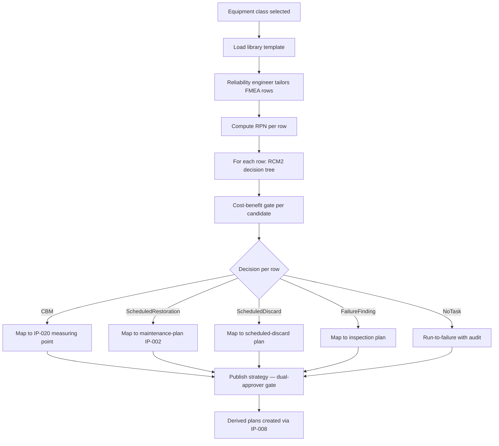

# IP-021: Reliability-Centered Maintenance (RCM) decision logic — SAE JA1011/JA1012 + Reliabilityweb RCM2

## A. Intent

Implements the **RCM decision logic engine** — the formal methodology for deriving maintenance tasks from equipment failure-mode analysis. The engine follows **SAE JA1011** (Evaluation Criteria for Reliability-Centered Maintenance Processes) and **SAE JA1012** (A Guide to the Reliability-Centered Maintenance Standard), as taught in **Reliabilityweb RCM2** (the Aladon-derived practitioner curriculum) and Moubray's *RCM II* canonical text.

The 7-question RCM decision flow:
1. What are the functions and associated performance standards in its present operating context?
2. In what ways can it fail to fulfil its functions?
3. What is the cause of each functional failure?
4. What are the effects of each failure?
5. In what way does each failure matter?
6. What can be done to predict or prevent each failure?
7. What should be done if no suitable proactive task can be found? (default action — redesign / run-to-failure / scheduled discard)

Industry-precedent equivalents: SAP EAM Asset Strategy Workbench (ASW), **IBM Maximo APM Health + Maximo Predict**, **Infor EAM Asset Sustainability + Reliability**, **GE Digital APM Reliability Analytics (Meridium)**, **Aveva APM Assessor**, **Bentley AssetWise APM**, **Hexagon APM**, **Cority APM**. Hyperscaler analog: AWS Fault Injection Simulator + AWS Resilience Hub (the methodology pattern transplanted to physical assets).

### A.1 Why RCM logic is non-trivial

1. **FMEA + criticality matrix is multi-input.** Each failure-mode row needs (probability, consequence, detectability) ranked 1-10; risk priority number (RPN) = P × C × D.
2. **Decision-tree navigation per failure-mode.** RCM2 decision tree picks task type: scheduled discard, scheduled restoration, on-condition (CBM), failure-finding, no-task (redesign/run-to-failure).
3. **Cost-benefit overlay.** Each candidate task is costed; RCM engine compares cost-of-task vs cost-of-failure × probability.
4. **Reliability data feedback.** Actual MTBF (from IP-022) feeds back into the probability estimate, refining the FMEA over time.
5. **Multi-tenant RCM library.** Generic RCM templates for equipment classes (pump, motor, valve, heat-exchanger); tenants customize.
6. **Auditable derivation chain.** Every published strategy (maintenance plan) is auditable back to RCM decision step.

## B. Acceptance criteria

- **AC-1:** FMEA worksheet domain object: `(equipment_class, function, functional_failure, failure_mode, effect, P, C, D, RPN)`.
- **AC-2:** RCM2 decision tree implemented; each failure-mode → one of (CBM, scheduled-restoration, scheduled-discard, failure-finding, no-task).
- **AC-3:** Cost-benefit gate: candidate task accepted only if `expected_cost_of_failure - cost_of_task > 0`.
- **AC-4:** Reliability feedback: nightly cron updates FMEA `P` from actual MTBF (IP-022).
- **AC-5:** RCM library: bootstrap templates per equipment class (centrifugal-pump, AC-motor, control-valve, plate-heat-exchanger, agitator, conveyor, hydraulic-cylinder, vfd, switchgear).
- **AC-6:** Audit chain: every generated maintenance-plan links back to FMEA row + RCM decision step.
- **AC-7:** Cedar gate on RCM-derived plan publish: reliability-engineer + planner dual-approver.
- **AC-8:** Cross-tenant FMEA load rejected.
- **AC-9:** RCM analysis publishable as `RcmStudyReport` PDF/JSON for auditor.
- **AC-10:** Audit events per §D-9.

## C. Verification

```bash
cargo test -p oya-plant-maintenance-rcm-domain -- fmea_worksheet_complete
cargo test -p oya-plant-maintenance-rcm-domain -- decision_tree_cbm_picked
cargo test -p oya-plant-maintenance-rcm-domain -- decision_tree_scheduled_discard_picked
cargo test -p oya-plant-maintenance-rcm-domain -- decision_tree_failure_finding_picked
cargo test -p oya-plant-maintenance-rcm-domain -- decision_tree_no_task_default
cargo test -p oya-plant-maintenance-rcm-domain -- cost_benefit_gate_blocks
cargo test -p oya-plant-maintenance-rcm-domain -- cost_benefit_gate_passes
cargo test -p oya-plant-maintenance-rcm-domain -- reliability_feedback_updates_p
cargo test -p oya-plant-maintenance-rcm-domain -- library_template_centrifugal_pump
cargo test -p oya-plant-maintenance-rcm-domain -- audit_chain_plan_to_fmea_step
cargo test -p oya-plant-maintenance-rcm-domain -- cedar_gate_dual_approver
cargo test -p oya-plant-maintenance-rcm-domain -- cross_tenant_rejected
```

## D. Detailed mechanics

### D-1. Data model

```sql
CREATE TABLE plant_maintenance.rcm_study (
    tenant_id        TEXT NOT NULL,
    study_id         TEXT NOT NULL,
    equipment_class  TEXT NOT NULL,
    operating_context TEXT NOT NULL,
    state            TEXT NOT NULL CHECK (state IN ('draft','published','revised','retired')),
    published_at     TIMESTAMPTZ,
    residency_pack   TEXT NOT NULL,
    hlc              TEXT NOT NULL,
    decision_id      UUID NOT NULL,
    PRIMARY KEY (tenant_id, study_id)
) PARTITION BY HASH (tenant_id);

CREATE TABLE plant_maintenance.fmea_row (
    tenant_id        TEXT NOT NULL,
    study_id         TEXT NOT NULL,
    row_no           INTEGER NOT NULL,
    function_desc    TEXT NOT NULL,
    functional_failure TEXT NOT NULL,
    failure_mode     TEXT NOT NULL,
    failure_effect   TEXT NOT NULL,
    severity         SMALLINT NOT NULL CHECK (severity BETWEEN 1 AND 10),
    probability      SMALLINT NOT NULL CHECK (probability BETWEEN 1 AND 10),
    detectability    SMALLINT NOT NULL CHECK (detectability BETWEEN 1 AND 10),
    rpn              SMALLINT GENERATED ALWAYS AS (severity * probability * detectability) STORED,
    consequence_category TEXT NOT NULL CHECK (consequence_category IN
        ('hidden','safety_env','operational','non_operational')),
    PRIMARY KEY (tenant_id, study_id, row_no)
) PARTITION BY HASH (tenant_id);

CREATE TABLE plant_maintenance.rcm_decision (
    tenant_id     TEXT NOT NULL,
    study_id      TEXT NOT NULL,
    row_no        INTEGER NOT NULL,
    task_kind     TEXT NOT NULL CHECK (task_kind IN
        ('cbm','scheduled_restoration','scheduled_discard','failure_finding','no_task_redesign','no_task_run_to_failure')),
    proposed_task TEXT NOT NULL,
    interval_days INTEGER,
    cost_of_task  NUMERIC(12,2),
    cost_of_failure NUMERIC(12,2),
    benefit_ratio NUMERIC(10,4) GENERATED ALWAYS AS
      (CASE WHEN cost_of_task > 0 THEN cost_of_failure / cost_of_task ELSE NULL END) STORED,
    derived_plan_id TEXT,
    PRIMARY KEY (tenant_id, study_id, row_no)
) PARTITION BY HASH (tenant_id);

CREATE TABLE plant_maintenance.rcm_library_template (
    equipment_class  TEXT NOT NULL,
    template_version INTEGER NOT NULL,
    template_json    JSONB NOT NULL,           -- FMEA + decision rows as starter set
    PRIMARY KEY (equipment_class, template_version)
);
```

### D-2. Rust types

```rust
#[derive(Debug, Clone)]
pub struct FmeaRow {
    pub row_no:           u32,
    pub function:         String,
    pub functional_failure: String,
    pub failure_mode:     String,
    pub failure_effect:   String,
    pub severity:         u8,
    pub probability:      u8,
    pub detectability:    u8,
    pub rpn:              u16,
    pub consequence_category: ConsequenceCategory,
}

#[derive(Debug, Clone)]
pub enum ConsequenceCategory { Hidden, SafetyEnv, Operational, NonOperational }

#[derive(Debug, Clone)]
pub enum TaskKind {
    Cbm, ScheduledRestoration, ScheduledDiscard, FailureFinding,
    NoTaskRedesign, NoTaskRunToFailure,
}
```

### D-3. RCM2 decision tree

```rust
pub fn rcm_decide(row: &FmeaRow, candidate_intervals: &TaskCandidates) -> RcmDecision {
    use ConsequenceCategory::*;
    // Step 1: classify consequence
    let consequence = row.consequence_category.clone();
    // Step 2: pick proactive task per consequence
    let proactive = match consequence {
        Hidden => failure_finding_task(row, candidate_intervals),
        SafetyEnv => safety_proactive_task(row, candidate_intervals),
        Operational | NonOperational => economic_proactive_task(row, candidate_intervals),
    };
    // Step 3: default-action fallback
    match proactive {
        Some(t) => RcmDecision::Proactive(t),
        None => match consequence {
            SafetyEnv => RcmDecision::Default(DefaultAction::Redesign),
            Hidden => RcmDecision::Default(DefaultAction::FailureFindingFallback),
            Operational | NonOperational => RcmDecision::Default(DefaultAction::RunToFailure),
        }
    }
}

fn safety_proactive_task(row: &FmeaRow, c: &TaskCandidates) -> Option<TaskDecision> {
    // Per RCM2: CBM preferred; if not technically feasible, scheduled restoration; if not, scheduled discard.
    c.cbm_candidates.first().map(|t| TaskDecision::cbm(t.clone()))
        .or_else(|| c.restoration_candidates.first().map(|t| TaskDecision::restoration(t.clone())))
        .or_else(|| c.discard_candidates.first().map(|t| TaskDecision::discard(t.clone())))
}

fn economic_proactive_task(row: &FmeaRow, c: &TaskCandidates) -> Option<TaskDecision> {
    c.candidates_with_positive_benefit(row).into_iter().max_by_key(|t| t.benefit_ratio_x1000())
}
```

### D-4. Cost-benefit gate

```rust
pub fn benefits_outweigh_cost(task: &TaskDecision, row: &FmeaRow, mtbf_days: u32) -> bool {
    let expected_failures_per_year = Decimal::from(365) / Decimal::from(mtbf_days);
    let expected_cost_of_failure_per_year = expected_failures_per_year * row.cost_of_failure_each();
    let expected_cost_of_task_per_year = task.frequency_per_year() * task.cost_each();
    expected_cost_of_failure_per_year - expected_cost_of_task_per_year > Decimal::ZERO
}
```

### D-5. Reliability-feedback cron

```rust
pub async fn refresh_fmea_probability_from_mtbf(state: &AppState) -> Result<usize, UseCaseError> {
    let rows = state.fmea_repo.list_published_rows().await?;
    let mut updated = 0;
    for row in rows {
        let mtbf = state.mtbf_client.get(&row.tenant_id, &row.failure_mode).await?;
        if let Some(mtbf_days) = mtbf.days {
            let new_p = probability_from_mtbf(mtbf_days);
            if new_p != row.probability {
                state.fmea_repo.update_probability(&row.tenant_id, &row.study_id, row.row_no, new_p).await?;
                updated += 1;
            }
        }
    }
    Ok(updated)
}

fn probability_from_mtbf(mtbf_days: u32) -> u8 {
    // RCM2 banding: <30d → 10; 30-90 → 8; 90-180 → 6; 180-365 → 4; 365-1095 → 2; >1095 → 1
    match mtbf_days {
        0..=29 => 10, 30..=89 => 8, 90..=179 => 6, 180..=364 => 4, 365..=1094 => 2, _ => 1,
    }
}
```

### D-6. Cedar context (publish RCM-derived plan)

```jsonc
{
  "principal": "oyatie::tenant::acme::user::reliability-engineer-12",
  "action":    "plant_maintenance::rcm::publish_strategy",
  "resource":  "plant_maintenance::rcm_study::RCM-PUMP-A-2026",
  "context": {
    "tenant_id": "acme",
    "study_id": "RCM-PUMP-A-2026",
    "equipment_class": "centrifugal_pump",
    "second_approver_principal": "oyatie::tenant::acme::user::maintenance-planner-3",
    "fmea_row_count": 24,
    "high_rpn_count": 6,
    "residency_pack": "global+us-osha-psm",
    "policy_bundle_version": "2026.05.20-r3",
    "byok_mode": "platform_default"
  }
}
```

### D-7. Workflow



### D-8. AsyncAPI envelopes

| Channel | Trigger | Consumers |
|---|---|---|
| `plant-maintenance.rcm.study-created.v1` | new study | ontology, audit |
| `plant-maintenance.rcm.study-published.v1` | dual-approver permit | maintenance-plan creator (IP-008) |
| `plant-maintenance.rcm.fmea-row-updated.v1` | reliability feedback | analytics |
| `plant-maintenance.rcm.cost-benefit-rejected.v1` | gate fail | reliability engineer review |

### D-9. SLO targets

| Operation | p50 | p95 | p99 |
|---|---|---|---|
| Create study from template | 60 ms | 140 ms | 280 ms |
| Decision-tree per row | 4 ms | 10 ms | 20 ms |
| Full study (24 rows) compute | 100 ms | 240 ms | 500 ms |
| Publish study (dual approver) | 80 ms | 180 ms | 360 ms |
| Reliability feedback cron (1000 studies) | 8 s | 18 s | 35 s |

### D-10. Audit-event registry

| Event class | Severity | Emitter |
|---|---|---|
| `EVT-PLANT_MAINTENANCE-RCM-STUDY_CREATED` | informational | usecase |
| `EVT-PLANT_MAINTENANCE-RCM-FMEA_ROW_ADDED` | informational | usecase |
| `EVT-PLANT_MAINTENANCE-RCM-DECISION_COMPUTED` | informational | usecase |
| `EVT-PLANT_MAINTENANCE-RCM-COST_BENEFIT_REJECTED` | warning | usecase |
| `EVT-PLANT_MAINTENANCE-RCM-STUDY_PUBLISHED` | informational | usecase |
| `EVT-PLANT_MAINTENANCE-RCM-RELIABILITY_FEEDBACK_APPLIED` | informational | scheduler |
| `EVT-PLANT_MAINTENANCE-RCM-CROSS_TENANT_REJECTED` | security | usecase |

### D-11. Failure modes & recovery

1. **`HighRpnNoFeasibleProactive`** — high-RPN row with no feasible proactive task. Default-action is redesign; alert plant manager + reliability engineer. Runbook `runbooks/rcm-no-proactive.md`.
2. **`TemplateOutOfDate`** — equipment-class template was retired. New template version offered; reliability engineer chooses. Runbook `runbooks/rcm-template-stale.md`.
3. **`MtbfFeedbackOutlier`** — single failure event skewed MTBF. Cron uses median-of-12-months window. Runbook `runbooks/mtbf-outlier.md`.
4. **`CostBenefitDataMissing`** — task lacks cost estimate. Mark `data_incomplete`; planner UI prompts. Runbook `runbooks/cost-benefit-missing.md`.
5. **`DualApproverSelf`** — same principal as engineer + planner. Cedar denies. Runbook `runbooks/rcm-dual-approver-self.md`.
6. **`PublishedStudyDriftFromTemplate`** — template revised, study based on old template. Show diff; ask reliability engineer to merge or maintain. Runbook `runbooks/rcm-template-drift.md`.

### D-12. Migration notes

Sources: SAP EAM Asset Strategy Workbench (ASW) export; GE Digital APM `MI_FMEA` family; Meridium / Aladon RCM Toolkit XML; Reliabilityweb RCM2-format FMEA spreadsheets.

### D-13. Cross-µservice handoffs

| Direction | Counterparty | Surface |
|---|---|---|
| outbound | `maintenance-plan` (IP-002/008) | gRPC create plan from RCM decision |
| outbound | `cbm-measuring-points` (IP-020) | gRPC create measuring-point from CBM decision |
| inbound | MTBF service (IP-022) | gRPC `mtbf.v1.Get` |
| outbound | `ontology` | study + FMEA + decision projection |
| outbound | `audit-chain` | per ADR-0263 |
| inbound | `equipment-master` (IP-001) | equipment-class info |

## E. Failure-mode summary

See D-11.

## F. Migration / rollback

Per-study feature flag. RCM library templates versioned; old versions remain available 90 days.

## G. References

- ADR-0105, ADR-0244, ADR-0252, ADR-0263, ADR-0294, ADR-0297, ADR-0314..0316.
- **SAE JA1011** Evaluation Criteria for RCM Processes; **SAE JA1012** Guide to the RCM Standard.
- John Moubray, *Reliability-Centered Maintenance II* (2nd ed., 1997).
- Reliabilityweb RCM2 practitioner curriculum (Aladon-derived).
- SAP EAM Asset Strategy Workbench documentation.
- Benchmarks: SAP ASW | IBM Maximo APM | Infor EAM Reliability | GE Digital APM Reliability Analytics | Aveva APM Assessor | Bentley AssetWise APM | Hexagon APM.

## H. Out of scope

- MTBF computation (IP-022), specific CBM signal collection (IP-020), maintenance-plan creation use-case (IP-008).

— end IP-021 —
