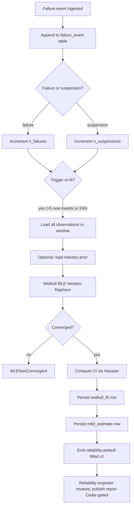

# IP-022: MTBF computation + Weibull distribution fitting for failure-rate analytics

## A. Intent

Implements the **MTBF (Mean-Time-Between-Failures)** and **Weibull distribution** fitting analytics — the statistical primitives that quantify equipment reliability from historical failure data. MTBF answers "how often does this equipment fail on average?" and the Weibull parameters (β shape, η scale) answer "what is the failure rate over time?".

The Weibull two-parameter distribution `f(t) = (β/η)(t/η)^(β-1) exp(-(t/η)^β)` is the canonical reliability distribution; β < 1 = infant mortality, β = 1 = random (exponential), β > 1 = wear-out. Fitting uses Maximum Likelihood Estimation (MLE) with right-censored observations (parts still running at observation cutoff).

Industry-precedent equivalents: ReliaSoft Weibull++ (the industry-standard tool), SAP PMIS reliability analytics, **IBM Maximo APM Health Analytics**, **GE Digital APM Reliability Analytics + Weibull**, **Aveva APM**, **Bentley AssetWise APM**, **Cority APM**. Hyperscaler analog: AWS SageMaker survival-analysis algorithms; the survival-analysis pattern is also the bread-and-butter of medical-research lifetable analytics — same math, different domain.

### A.1 Why reliability analytics is non-trivial

1. **Right-censoring is the norm.** Most equipment is still running at the time of analysis; failure-time data is right-censored. MLE must handle censored observations correctly.
2. **Mixed failure modes.** A pump fails by bearing-fatigue, seal-leak, or impeller-corrosion; each has its own Weibull. Aggregating gives bath-tub shape; segregating gives mode-specific β/η.
3. **Suspension data.** "Pump replaced before failure" is a suspension, not a failure. Counting suspensions as failures inflates failure rate.
4. **Confidence intervals.** β and η have error bars; small samples produce wide intervals; reliability engineer must see CI not just point estimate.
5. **Bayesian updating.** As new failures accrue, posterior β/η update; engine must support online updating.
6. **Cross-tenant reference distributions.** Industry-wide Weibull priors for common equipment (e.g., "ANSI B73.1 pump bearing") can prior-inform fitting.

## B. Acceptance criteria

- **AC-1:** `ComputeMtbfUseCase::execute(equipment_class, mode, window)` returns MTBF + 95% CI; handles right-censored observations.
- **AC-2:** `FitWeibullUseCase::execute(failure_times, suspensions)` returns β, η, log-likelihood, CI via MLE.
- **AC-3:** Suspension handling: caller flags each observation as `failed` or `suspended`.
- **AC-4:** Mixed-mode segregation: per-failure-mode Weibull fitting supported.
- **AC-5:** Bayesian update: posterior β/η computed from prior + new observations.
- **AC-6:** Industry-prior library: bootstrap priors for 10+ equipment classes.
- **AC-7:** Confidence-interval reporting at 90% / 95% / 99% bands.
- **AC-8:** Online refresh: new failure event triggers Weibull re-fit within 60s.
- **AC-9:** Cross-tenant load rejected.
- **AC-10:** Audit events per §D-9.

## C. Verification

```bash
cargo test -p oya-plant-maintenance-reliability-analytics -- mtbf_no_censoring
cargo test -p oya-plant-maintenance-reliability-analytics -- mtbf_with_right_censoring
cargo test -p oya-plant-maintenance-reliability-analytics -- mtbf_ci_95_percent
cargo test -p oya-plant-maintenance-reliability-analytics -- weibull_mle_pure_failure_data
cargo test -p oya-plant-maintenance-reliability-analytics -- weibull_mle_with_suspensions
cargo test -p oya-plant-maintenance-reliability-analytics -- weibull_beta_lt_1_infant_mortality
cargo test -p oya-plant-maintenance-reliability-analytics -- weibull_beta_eq_1_exponential
cargo test -p oya-plant-maintenance-reliability-analytics -- weibull_beta_gt_1_wearout
cargo test -p oya-plant-maintenance-reliability-analytics -- multi_mode_segregation
cargo test -p oya-plant-maintenance-reliability-analytics -- bayesian_posterior_update
cargo test -p oya-plant-maintenance-reliability-analytics -- industry_prior_library_pump
cargo test -p oya-plant-maintenance-reliability-analytics -- online_refit_on_new_failure
cargo test -p oya-plant-maintenance-reliability-analytics -- cross_tenant_rejected
```

## D. Detailed mechanics

### D-1. Data model

```sql
CREATE TABLE plant_maintenance.failure_event (
    tenant_id       TEXT NOT NULL,
    event_id        TEXT NOT NULL,
    equipment_id    TEXT NOT NULL,
    equipment_class TEXT NOT NULL,
    failure_mode    TEXT NOT NULL,
    time_to_failure_h NUMERIC(18,3) NOT NULL,   -- hours since commissioning or last replacement
    was_suspension  BOOLEAN NOT NULL DEFAULT FALSE,
    associated_wo_id TEXT,
    observed_at     TIMESTAMPTZ NOT NULL,
    hlc             TEXT NOT NULL,
    PRIMARY KEY (tenant_id, event_id)
) PARTITION BY HASH (tenant_id);

CREATE TABLE plant_maintenance.mtbf_estimate (
    tenant_id       TEXT NOT NULL,
    equipment_class TEXT NOT NULL,
    failure_mode    TEXT NOT NULL,
    window_start    DATE NOT NULL,
    window_end      DATE NOT NULL,
    n_failures      INTEGER NOT NULL,
    n_suspensions   INTEGER NOT NULL,
    mtbf_h          NUMERIC(18,3) NOT NULL,
    mtbf_ci_lo_95   NUMERIC(18,3) NOT NULL,
    mtbf_ci_hi_95   NUMERIC(18,3) NOT NULL,
    computed_at     TIMESTAMPTZ NOT NULL DEFAULT now(),
    PRIMARY KEY (tenant_id, equipment_class, failure_mode, window_start)
) PARTITION BY HASH (tenant_id);

CREATE TABLE plant_maintenance.weibull_fit (
    tenant_id       TEXT NOT NULL,
    equipment_class TEXT NOT NULL,
    failure_mode    TEXT NOT NULL,
    beta            NUMERIC(10,4) NOT NULL,
    eta             NUMERIC(18,4) NOT NULL,
    beta_ci_lo_95   NUMERIC(10,4) NOT NULL,
    beta_ci_hi_95   NUMERIC(10,4) NOT NULL,
    eta_ci_lo_95    NUMERIC(18,4) NOT NULL,
    eta_ci_hi_95    NUMERIC(18,4) NOT NULL,
    log_likelihood  NUMERIC(18,6) NOT NULL,
    n_failures      INTEGER NOT NULL,
    n_suspensions   INTEGER NOT NULL,
    prior_id        TEXT,
    fitted_at       TIMESTAMPTZ NOT NULL DEFAULT now(),
    PRIMARY KEY (tenant_id, equipment_class, failure_mode, fitted_at)
) PARTITION BY HASH (tenant_id);

CREATE TABLE plant_maintenance.industry_prior (
    prior_id        TEXT PRIMARY KEY,
    equipment_class TEXT NOT NULL,
    failure_mode    TEXT NOT NULL,
    beta_prior      NUMERIC(10,4) NOT NULL,
    eta_prior       NUMERIC(18,4) NOT NULL,
    source          TEXT NOT NULL    -- e.g., 'OREDA 2015 — pump bearing'
);
```

### D-2. Rust types + Weibull MLE

```rust
#[derive(Debug, Clone)]
pub struct Observation {
    pub time_to_event_h: f64,
    pub kind: ObsKind,
}

#[derive(Debug, Clone, Copy)]
pub enum ObsKind { Failure, Suspension }

#[derive(Debug, Clone)]
pub struct WeibullFit {
    pub beta:           f64,
    pub eta:            f64,
    pub beta_ci_95:     (f64, f64),
    pub eta_ci_95:      (f64, f64),
    pub log_likelihood: f64,
}

pub fn weibull_mle(observations: &[Observation], prior: Option<&IndustryPrior>) -> Result<WeibullFit, FitError> {
    if observations.len() < 3 { return Err(FitError::InsufficientData); }
    let (failures, _): (Vec<_>, Vec<_>) = observations.iter().partition(|o| matches!(o.kind, ObsKind::Failure));
    if failures.is_empty() { return Err(FitError::NoFailures); }

    // Initial estimates via probability-plot regression
    let (beta_0, eta_0) = prior.map(|p| (p.beta as f64, p.eta as f64))
        .unwrap_or_else(|| pp_regression_init(observations));

    // Newton-Raphson on log-likelihood
    let (beta_hat, eta_hat) = newton_raphson(observations, beta_0, eta_0, /*max_iter*/ 50, /*tol*/ 1e-7)?;
    let log_l = log_likelihood(observations, beta_hat, eta_hat);
    let hessian = numerical_hessian(observations, beta_hat, eta_hat);
    let (beta_ci, eta_ci) = wald_ci(beta_hat, eta_hat, &hessian, 0.95);
    Ok(WeibullFit { beta: beta_hat, eta: eta_hat, beta_ci_95: beta_ci, eta_ci_95: eta_ci, log_likelihood: log_l })
}

fn log_likelihood(obs: &[Observation], beta: f64, eta: f64) -> f64 {
    obs.iter().map(|o| {
        let t = o.time_to_event_h;
        match o.kind {
            ObsKind::Failure    => (beta/eta).ln() + (beta - 1.0) * (t/eta).ln() - (t/eta).powf(beta),
            ObsKind::Suspension => -(t/eta).powf(beta),
        }
    }).sum()
}
```

### D-3. MTBF (with right-censoring)

```rust
pub fn mtbf(observations: &[Observation]) -> Result<MtbfEstimate, FitError> {
    let mut total_h = 0.0;
    let mut n_failures = 0;
    for o in observations {
        total_h += o.time_to_event_h;
        if matches!(o.kind, ObsKind::Failure) { n_failures += 1; }
    }
    if n_failures == 0 { return Err(FitError::NoFailures); }
    let mtbf = total_h / n_failures as f64;
    // Chi-squared 95% CI per IEC 61703
    let chi_lo = chi_sq_quantile(0.025, 2.0 * n_failures as f64);
    let chi_hi = chi_sq_quantile(0.975, 2.0 * n_failures as f64);
    Ok(MtbfEstimate {
        mtbf_h: mtbf,
        ci_95_lo_h: 2.0 * total_h / chi_hi,
        ci_95_hi_h: 2.0 * total_h / chi_lo,
        n_failures,
        n_suspensions: observations.len() - n_failures,
    })
}
```

### D-4. Cedar context (publish reliability report)

```jsonc
{
  "principal": "oyatie::tenant::acme::user::reliability-engineer-12",
  "action":    "plant_maintenance::reliability::publish_report",
  "resource":  "plant_maintenance::weibull_fit::pump-bearing-2026-05",
  "context": {
    "tenant_id": "acme",
    "equipment_class": "centrifugal_pump",
    "failure_mode": "bearing_fatigue",
    "n_failures": 23,
    "n_suspensions": 187,
    "beta_estimate": 2.4,
    "eta_estimate_h": 28800,
    "residency_pack": "global",
    "policy_bundle_version": "2026.05.20-r3",
    "byok_mode": "platform_default"
  }
}
```

### D-5. Workflow



### D-6. AsyncAPI envelopes

| Channel | Trigger | Consumers |
|---|---|---|
| `plant-maintenance.failure-event.observed.v1` | ingest | analytics, RCM feedback |
| `plant-maintenance.reliability.weibull-fitted.v1` | re-fit | RCM feedback, dashboards |
| `plant-maintenance.reliability.mtbf-computed.v1` | re-compute | dashboards |
| `plant-maintenance.reliability.fit-degraded.v1` | n_failures < 3 | reliability engineer (data quality) |

### D-7. SLO targets

| Operation | p50 | p95 | p99 |
|---|---|---|---|
| MTBF compute (1000 events) | 12 ms | 28 ms | 60 ms |
| Weibull MLE (200 events) | 80 ms | 180 ms | 360 ms |
| Weibull MLE (10000 events) | 600 ms | 1.4 s | 2.8 s |
| Online refit trigger | 4 ms | 10 ms | 22 ms |
| Bayesian update (prior + 50 new) | 35 ms | 80 ms | 160 ms |

### D-8. Industry-prior library (bootstrap)

| Equipment class | Failure mode | β prior | η prior (hours) | Source |
|---|---|---|---|---|
| centrifugal_pump | bearing_fatigue | 2.2 | 30 000 | OREDA 2015 |
| centrifugal_pump | seal_leak | 1.6 | 18 000 | OREDA 2015 |
| centrifugal_pump | impeller_corrosion | 1.9 | 50 000 | API 610 lifecycle |
| ac_motor | bearing_fatigue | 2.4 | 60 000 | OREDA 2015 |
| ac_motor | winding_short | 1.0 | 70 000 | IEEE Std 493 |
| control_valve | actuator_fail | 1.8 | 25 000 | ISA 84 |
| heat_exchanger_plate | gasket_leak | 1.7 | 30 000 | TEMA |
| heat_exchanger_plate | tube_fouling | 2.5 | 12 000 | TEMA |
| hydraulic_cylinder | seal_failure | 1.9 | 22 000 | NFPA T2.6.1 |
| vfd | igbt_failure | 1.2 | 60 000 | IEEE Std 1709 |
| switchgear | contact_wear | 1.5 | 100 000 | IEC 62271 |

### D-9. Audit-event registry

| Event class | Severity | Emitter |
|---|---|---|
| `EVT-PLANT_MAINTENANCE-RELIABILITY-FAILURE_EVENT_OBSERVED` | informational | adapter |
| `EVT-PLANT_MAINTENANCE-RELIABILITY-WEIBULL_FITTED` | informational | usecase |
| `EVT-PLANT_MAINTENANCE-RELIABILITY-MTBF_COMPUTED` | informational | usecase |
| `EVT-PLANT_MAINTENANCE-RELIABILITY-FIT_NON_CONVERGENT` | warning | usecase |
| `EVT-PLANT_MAINTENANCE-RELIABILITY-INSUFFICIENT_DATA` | warning | usecase |
| `EVT-PLANT_MAINTENANCE-RELIABILITY-INDUSTRY_PRIOR_APPLIED` | informational | usecase |
| `EVT-PLANT_MAINTENANCE-RELIABILITY-REPORT_PUBLISHED` | informational | usecase |
| `EVT-PLANT_MAINTENANCE-RELIABILITY-CROSS_TENANT_REJECTED` | security | usecase |

### D-10. Failure modes & recovery

1. **`MleNonConvergent`** — Newton-Raphson diverges. Fall back to method-of-moments estimate; flag `convergence_warn`. Runbook `runbooks/mle-divergent.md`.
2. **`InsufficientData`** — < 3 failures. Use industry prior alone; emit data-quality warning. Runbook `runbooks/insufficient-failure-data.md`.
3. **`MixedModeContamination`** — single Weibull fit over multiple modes shows non-fit (KS-test fail). Auto-segregate by mode if data tagged. Runbook `runbooks/mixed-mode-suspected.md`.
4. **`PriorMismatch`** — industry prior far from data. Posterior tilts; reliability engineer reviews prior. Runbook `runbooks/prior-mismatch.md`.
5. **`OnlineRefitLag`** — re-fit queue backed up. Auto-throttle to per-class once-per-hour during burst; warn. Runbook `runbooks/refit-lag.md`.
6. **`SuspensionMislabeled`** — a "suspension" was actually a failure (data-entry error). Audit lets reliability engineer reclassify; refit triggered. Runbook `runbooks/suspension-mislabeled.md`.

### D-11. Migration notes

Sources: SAP `PMNT` (notification) + `QMEL/QMIH` (notification item) join → failure-event rows; ReliaSoft Weibull++ XML import; IBM Maximo `WORKORDER` + `DOWNTIMEHIST` for failure dates.

### D-12. Cross-µservice handoffs

| Direction | Counterparty | Surface |
|---|---|---|
| inbound | `work-order` (IP-009) | AsyncAPI `wo.closed.v1` if failure WO → emit failure_event |
| outbound | `rcm` (IP-021) | gRPC `mtbf.v1.Get` for FMEA probability feedback |
| outbound | `intelligence` | optional ML augmentation per ADR-0257 |
| outbound | `analytics` / dashboards | reliability dashboards |
| outbound | `ontology` | failure_event + weibull_fit projection |

## E. Failure-mode summary

See D-10.

## F. Migration / rollback

Per-equipment-class feature flag. Industry-prior library versioned; opt-in per tenant.

## G. References

- ADR-0105, ADR-0244, ADR-0252, ADR-0257, ADR-0263, ADR-0294, ADR-0297, ADR-0314..0316.
- IEC 61703 Reliability data analysis; IEEE Std 493 (IEEE Std 493).
- **OREDA** Offshore Reliability Data Handbook (2015).
- API Std 610 / TEMA / ISA 84 / NFPA T2.6.1 / IEC 62271 (per equipment class).
- ReliaSoft Weibull++ user guide.
- SAP PMIS analytics docs; GE Digital APM Reliability Analytics docs.

## H. Out of scope

- RCM decision logic (IP-021), failure-event ingest UX (lives in work-order completion flow), real-time signals (IP-020).

— end IP-022 —
