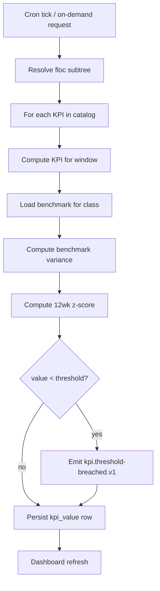

# IP-023: Maintenance KPI scorecard — OEE / availability / MTTR / first-time-fix-rate / PM compliance

## A. Intent

Implements the **Maintenance KPI scorecard** — the canonical leaderboard of plant + line + equipment performance metrics, presented as a single dashboard for plant managers and executives. The seven canonical metrics:

1. **OEE (Overall Equipment Effectiveness)** = Availability × Performance × Quality (per VDMA 66412).
2. **Availability** = (planned_run_time - downtime) / planned_run_time.
3. **MTTR (Mean Time To Repair)** = total_repair_minutes / n_breakdowns.
4. **MTBF (Mean Time Between Failures)** — link to IP-022.
5. **First-Time-Fix Rate (FTFR)** = n_one_visit_repairs / n_total_repairs.
6. **PM Compliance** = n_pm_on_time / n_pm_scheduled.
7. **Maintenance Cost per Output Unit** = total_maintenance_cost / total_units_produced.

Industry-precedent equivalents: SAP PMIS + SAP MaintenanceWorkbenchKPI, **IBM Maximo APM KPI Manager**, **Infor EAM KPI dashboard**, **Oracle Fusion Maintenance Cloud KPI workbench**, **IFS Cloud KPI Manager**, **GE Digital APM Health Manager scorecard**, **Aveva APM dashboards**, **PTC ThingWorx KPI app**. Hyperscaler analog: AWS QuickSight dashboards over CloudWatch metrics; Datadog Service Performance dashboard.

### A.1 Why KPI scorecard is non-trivial

1. **Multi-source aggregation.** OEE pulls from downtime (IP-006/012); MTTR pulls from work-order (IP-003); PM compliance from maintenance-plan (IP-002). All time-window-coherent.
2. **Tenant-customizable formulas.** Some tenants compute MTTR as "ticket-open to ticket-closed"; others as "tech-on-site to repair-complete". Per-tenant formula registry.
3. **Drill-down hierarchies.** Plant → process unit → line → equipment. Same KPI roll-up math at each level.
4. **Time-window roll-ups.** Daily / weekly / monthly / YTD; pre-computed caches with cron refresh.
5. **Benchmark comparison.** Per-equipment-class industry benchmarks (e.g., OEE ≥ 85% is world-class per Nakajima); UI shows variance from benchmark.
6. **Alerting thresholds.** If KPI crosses tenant-configured floor (e.g., availability < 90%), emit `kpi.threshold-breached.v1` event.

## B. Acceptance criteria

- **AC-1:** KPI catalog: OEE, Availability, MTTR, MTBF, FTFR, PM_Compliance, Maintenance_Cost_Per_Unit; all seven implemented.
- **AC-2:** Per-tenant formula registry; default formulas + tenant overrides; audit on override change.
- **AC-3:** Drill-down hierarchy: plant → process unit → line → equipment using floc parent-path (IP-001).
- **AC-4:** Time-window roll-ups: daily, weekly, monthly, YTD; cached + refreshed by cron.
- **AC-5:** Industry-benchmark library: OEE / availability / MTTR / MTBF / FTFR / PM-compliance benchmarks per class.
- **AC-6:** Threshold alerting: tenant-configurable floor; emit on breach.
- **AC-7:** Trend lines: 12-week rolling window with anomaly detection (z-score > 2).
- **AC-8:** Cross-tenant load rejected.
- **AC-9:** Scorecard API: REST `/v1/tenants/:tenant/scorecard?floc=X&window=Y` returns full breakdown.
- **AC-10:** Audit events per §D-9.

## C. Verification

```bash
cargo test -p oya-plant-maintenance-kpi-scorecard -- oee_aggregates_from_downtime
cargo test -p oya-plant-maintenance-kpi-scorecard -- mttr_computes_from_wo
cargo test -p oya-plant-maintenance-kpi-scorecard -- mtbf_pulls_from_ip_022
cargo test -p oya-plant-maintenance-kpi-scorecard -- ftfr_excludes_callbacks
cargo test -p oya-plant-maintenance-kpi-scorecard -- pm_compliance_within_tolerance
cargo test -p oya-plant-maintenance-kpi-scorecard -- cost_per_unit_from_finops
cargo test -p oya-plant-maintenance-kpi-scorecard -- tenant_formula_override_audited
cargo test -p oya-plant-maintenance-kpi-scorecard -- drill_down_plant_to_equipment
cargo test -p oya-plant-maintenance-kpi-scorecard -- rolling_12wk_trend
cargo test -p oya-plant-maintenance-kpi-scorecard -- benchmark_compare_variance
cargo test -p oya-plant-maintenance-kpi-scorecard -- threshold_breach_emits_event
cargo test -p oya-plant-maintenance-kpi-scorecard -- cross_tenant_rejected
```

## D. Detailed mechanics

### D-1. Data model

```sql
CREATE TABLE plant_maintenance.kpi_formula (
    tenant_id    TEXT NOT NULL,
    kpi_code     TEXT NOT NULL CHECK (kpi_code IN
        ('oee','availability','mttr','mtbf','ftfr','pm_compliance','maint_cost_per_unit')),
    formula_expr TEXT NOT NULL,
    is_default   BOOLEAN NOT NULL DEFAULT TRUE,
    version      INTEGER NOT NULL,
    hlc          TEXT NOT NULL,
    decision_id  UUID NOT NULL,
    PRIMARY KEY (tenant_id, kpi_code, version)
) PARTITION BY HASH (tenant_id);

CREATE TABLE plant_maintenance.kpi_value (
    tenant_id      TEXT NOT NULL,
    floc_id        TEXT NOT NULL,
    kpi_code       TEXT NOT NULL,
    window_kind    TEXT NOT NULL CHECK (window_kind IN ('daily','weekly','monthly','ytd')),
    window_start   DATE NOT NULL,
    window_end     DATE NOT NULL,
    value          NUMERIC(18,6) NOT NULL,
    derivation_json JSONB NOT NULL,
    benchmark_compare NUMERIC(10,4),
    z_score_12wk   NUMERIC(10,4),
    computed_at    TIMESTAMPTZ NOT NULL DEFAULT now(),
    PRIMARY KEY (tenant_id, floc_id, kpi_code, window_kind, window_start)
) PARTITION BY HASH (tenant_id);

CREATE TABLE plant_maintenance.kpi_threshold (
    tenant_id    TEXT NOT NULL,
    floc_id      TEXT,                       -- NULL = tenant-wide
    kpi_code     TEXT NOT NULL,
    floor_value  NUMERIC(18,6) NOT NULL,
    ceiling_value NUMERIC(18,6),
    alert_severity TEXT NOT NULL CHECK (alert_severity IN ('informational','warning','critical','p0')),
    PRIMARY KEY (tenant_id, COALESCE(floc_id, ''), kpi_code)
) PARTITION BY HASH (tenant_id);

CREATE TABLE plant_maintenance.kpi_benchmark (
    equipment_class TEXT NOT NULL,
    kpi_code        TEXT NOT NULL,
    industry_median NUMERIC(18,6) NOT NULL,
    industry_p90    NUMERIC(18,6) NOT NULL,
    world_class     NUMERIC(18,6) NOT NULL,
    source          TEXT NOT NULL,
    PRIMARY KEY (equipment_class, kpi_code)
);
```

### D-2. Rust types

```rust
#[derive(Debug, Clone)]
pub enum KpiCode {
    Oee, Availability, Mttr, Mtbf, Ftfr, PmCompliance, MaintCostPerUnit,
}

#[derive(Debug, Clone)]
pub struct KpiValue {
    pub tenant_id:    TenantId,
    pub floc_id:      FlocId,
    pub kpi_code:     KpiCode,
    pub window:       WindowSpan,
    pub value:        Decimal,
    pub derivation:   serde_json::Value,
    pub benchmark_compare: Option<Decimal>,
    pub z_score_12wk: Option<Decimal>,
}

#[derive(Debug, Clone)]
pub struct WindowSpan {
    pub kind:  WindowKind,
    pub start: NaiveDate,
    pub end:   NaiveDate,
}

#[derive(Debug, Clone)]
pub enum WindowKind { Daily, Weekly, Monthly, Ytd }
```

### D-3. KPI computation engine

```rust
pub async fn compute_kpi(
    kpi: KpiCode, tenant: &TenantId, floc: &FlocId, window: WindowSpan,
    downtime: &impl DowntimeRepository, wo: &impl WorkOrderRepository,
    plan: &impl MaintenancePlanRepository, mtbf_client: &impl MtbfClient,
    finops: &impl FinopsClient, prodplan: &impl ProductionPlanningClient,
) -> Result<KpiValue, KpiError> {
    let derivation: serde_json::Value;
    let value = match kpi {
        KpiCode::Oee => {
            let windows = downtime.list_for_floc_window(tenant, floc, &window).await?;
            let meta = prodplan.production_meta(tenant, floc, window.start..=window.end).await?;
            let downtime_min = windows.iter().map(|w| w.duration_min()).sum::<Decimal>();
            let bd = oee(meta.planned_run_min, downtime_min, meta.ideal_cycle_s,
                         meta.actual_count, meta.good_count, meta.total_count);
            derivation = json!({ "availability_pct": bd.availability_pct, "performance_pct": bd.performance_pct, "quality_pct": bd.quality_pct });
            bd.oee_pct
        }
        KpiCode::Availability => {
            let windows = downtime.list_for_floc_window(tenant, floc, &window).await?;
            let meta = prodplan.production_meta(tenant, floc, window.start..=window.end).await?;
            let downtime_min = windows.iter().map(|w| w.duration_min()).sum::<Decimal>();
            let avail = (meta.planned_run_min - downtime_min) / meta.planned_run_min * Decimal::from(100);
            derivation = json!({ "planned_run_min": meta.planned_run_min, "downtime_min": downtime_min });
            avail
        }
        KpiCode::Mttr => {
            let breakdowns = wo.list_breakdowns_for_floc_window(tenant, floc, &window).await?;
            let total_min: Decimal = breakdowns.iter().map(|w| w.repair_duration_min()).sum();
            let n = breakdowns.len() as i64;
            derivation = json!({ "n_breakdowns": n, "total_repair_min": total_min });
            if n == 0 { Decimal::ZERO } else { total_min / Decimal::from(n) }
        }
        KpiCode::Mtbf => {
            let m = mtbf_client.get_for_floc(tenant, floc, &window).await?;
            derivation = json!({ "n_failures": m.n_failures, "ci_95_lo_h": m.ci_95_lo_h, "ci_95_hi_h": m.ci_95_hi_h });
            Decimal::from_f64(m.mtbf_h).unwrap_or_default()
        }
        KpiCode::Ftfr => {
            let wos = wo.list_repairs_for_floc_window(tenant, floc, &window).await?;
            let total = wos.len() as i64;
            let one_visit = wos.iter().filter(|w| w.callback_count == 0).count() as i64;
            derivation = json!({ "n_total": total, "n_one_visit": one_visit });
            if total == 0 { Decimal::ZERO } else { Decimal::from(one_visit) / Decimal::from(total) * Decimal::from(100) }
        }
        KpiCode::PmCompliance => {
            let plans = plan.list_due_in_window_for_floc(tenant, floc, &window).await?;
            let total = plans.len() as i64;
            let on_time = plans.iter().filter(|p| p.completed_within_tolerance()).count() as i64;
            derivation = json!({ "n_due": total, "n_on_time": on_time });
            if total == 0 { Decimal::ZERO } else { Decimal::from(on_time) / Decimal::from(total) * Decimal::from(100) }
        }
        KpiCode::MaintCostPerUnit => {
            let cost = finops.maintenance_cost_for_floc(tenant, floc, &window).await?;
            let meta = prodplan.production_meta(tenant, floc, window.start..=window.end).await?;
            derivation = json!({ "total_cost": cost, "units_produced": meta.good_count });
            if meta.good_count == 0 { Decimal::ZERO } else { cost / Decimal::from(meta.good_count) }
        }
    };
    Ok(KpiValue { tenant_id: tenant.clone(), floc_id: floc.clone(), kpi_code: kpi, window, value, derivation, benchmark_compare: None, z_score_12wk: None })
}
```

### D-4. Benchmark comparison

```rust
pub fn benchmark_compare(kpi: &KpiValue, bench: &KpiBenchmark) -> Decimal {
    // Returns multiplier vs world-class (1.0 = world-class)
    if bench.world_class.is_zero() { return Decimal::ZERO; }
    kpi.value / bench.world_class
}
```

### D-5. Cedar context (override formula)

```jsonc
{
  "principal": "oyatie::tenant::acme::user::plant-manager-5",
  "action":    "plant_maintenance::kpi::override_formula",
  "resource":  "plant_maintenance::kpi_formula::mttr",
  "context": {
    "tenant_id": "acme",
    "kpi_code": "mttr",
    "new_formula": "actual_repair_duration_min_only",
    "rationale": "exclude wait-for-permit time from MTTR per OSHA audit recommendation",
    "policy_bundle_version": "2026.05.20-r3",
    "residency_pack": "global+us-osha-psm",
    "byok_mode": "platform_default"
  }
}
```

### D-6. Workflow



### D-7. AsyncAPI envelopes

| Channel | Trigger | Consumers |
|---|---|---|
| `plant-maintenance.kpi.refreshed.v1` | cron / on-demand | dashboards |
| `plant-maintenance.kpi.threshold-breached.v1` | floor crossed | alerting, plant-manager-pager |
| `plant-maintenance.kpi.benchmark-variance.v1` | > 25% below world-class | reliability engineer |
| `plant-maintenance.kpi.formula-overridden.v1` | Cedar permit | audit |

### D-8. SLO targets

| Operation | p50 | p95 | p99 |
|---|---|---|---|
| Compute single KPI (equipment level, 1 day) | 35 ms | 80 ms | 160 ms |
| Compute full scorecard (plant subtree, 7 KPIs) | 800 ms | 1.8 s | 3.5 s |
| GET /scorecard (cached) | 15 ms | 35 ms | 70 ms |
| GET /scorecard (cache miss) | 800 ms | 1.8 s | 3.5 s |
| Cron refresh (top-100 flocs × 7 KPIs) | 60 s | 120 s | 240 s |

### D-9. Audit-event registry

| Event class | Severity | Emitter |
|---|---|---|
| `EVT-PLANT_MAINTENANCE-KPI-REFRESHED` | informational | scheduler/usecase |
| `EVT-PLANT_MAINTENANCE-KPI-THRESHOLD_BREACHED` | warning | usecase |
| `EVT-PLANT_MAINTENANCE-KPI-FORMULA_OVERRIDDEN` | informational | usecase |
| `EVT-PLANT_MAINTENANCE-KPI-BENCHMARK_VARIANCE_HIGH` | warning | usecase |
| `EVT-PLANT_MAINTENANCE-KPI-Z_SCORE_ANOMALY` | warning | usecase |
| `EVT-PLANT_MAINTENANCE-KPI-CROSS_TENANT_REJECTED` | security | usecase |

### D-10. Failure modes & recovery

1. **`SourceDataLag`** — downtime / WO / cost source µservice lags. KPI computed with `data_lag_warning` flag; rerun after refresh. Runbook `runbooks/source-data-lag.md`.
2. **`FormulaOverrideInvalid`** — tenant-supplied formula fails parser. Cedar gate denies on parse fail; supervisor notified. Runbook `runbooks/formula-parse-fail.md`.
3. **`BenchmarkMissing`** — equipment-class has no benchmark. Variance set null; UI suppresses variance widget. Runbook `runbooks/benchmark-missing.md`.
4. **`ZScoreUnstableSmallN`** — < 12 weeks of history. Z-score suppressed; UI shows "insufficient history". Runbook `runbooks/zscore-insufficient.md`.
5. **`ThresholdAlertStorm`** — bulk import causes many breach events. Aggregate into one summary alert per plant. Runbook `runbooks/threshold-storm.md`.
6. **`CrossKpiInconsistency`** — Availability + Performance × Quality ≠ OEE due to source desync. Reconciliation cron flags; fresh-pull mandated. Runbook `runbooks/kpi-inconsistency.md`.

### D-11. Migration notes

Sources: SAP PMIS info structures `S061` (equipment downtime), `S062` (PM completion), `S063` (notification analysis); IBM Maximo KPI Manager XML export; GE Digital APM `MI_HEALTH_INDICATOR` family.

### D-12. Cross-µservice handoffs

| Direction | Counterparty | Surface |
|---|---|---|
| inbound | `downtime-window` (IP-006/012) | DB read of downtime + OEE rollup |
| inbound | `work-order` (IP-003/009) | DB read of breakdown WO + repair durations |
| inbound | `maintenance-plan` (IP-002/008) | DB read of plan compliance |
| inbound | reliability (IP-022) | gRPC `mtbf.v1.GetForFloc` |
| inbound | `oya-cloud-finops` | gRPC `finops.v1.MaintenanceCost` |
| inbound | `production-planning` | gRPC `prodplan.v1.GetProductionMeta` |
| outbound | dashboards | AsyncAPI refresh events |
| outbound | alerting | AsyncAPI threshold-breached |

## E. Failure-mode summary

See D-10.

## F. Migration / rollback

Per-KPI feature flag. Tenant-formula overrides versioned; revert via prior version.

## G. References

- ADR-0105, ADR-0244, ADR-0252, ADR-0263, ADR-0294, ADR-0297, ADR-0314..0316.
- VDMA 66412 (OEE); Nakajima *Introduction to TPM*.
- ISO 14224 reliability metrics for petroleum & natural gas.
- SAP PMIS info structure docs.
- Benchmarks: SAP MaintenanceWorkbenchKPI | IBM Maximo APM KPI Manager | Infor EAM KPI | Oracle Fusion KPI workbench | IFS Cloud KPI Manager | GE Digital APM | Aveva APM | PTC ThingWorx.

## H. Out of scope

- Source data primitives (IP-002/003/006/022/IP-006); cost data (lives in finops); production data (lives in production-planning).

— end IP-023 —
