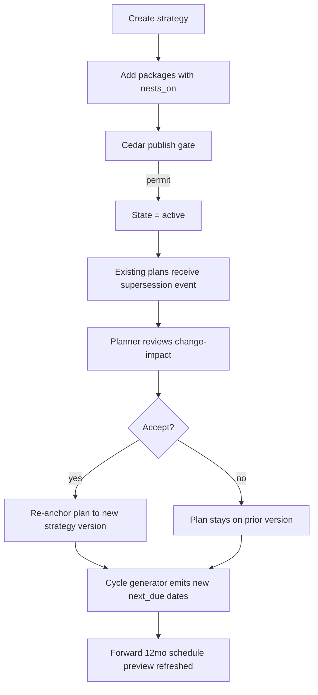

# IP-024: Maintenance strategy + cycle generation (time-based + performance-based) — due-date calculator

## A. Intent

Implements the **Maintenance Strategy** authoring + **cycle generation** engine — the higher-level abstraction over IP-002 maintenance plans. A *strategy* (SAP `T351` / `T351P`) defines a family of nested packages (A: 30d, B: 90d = A+restoration, C: 365d = B+overhaul); plans bind to a strategy and inherit its package cadence. Performance-based cycles (running-hours / cycles / km) generate due-dates via projected counter trajectories from CBM signals (IP-020).

Mirrors SAP `PM-PRM` strategy + cycle authoring with transactions `IP11` (strategy maintain), `IP12` (package), `IP19` (schedule overview), `IP24` (cycle schedule). Industry-precedent equivalents: **IBM Maximo PM Sequence + Job Plan inheritance**, **Infor EAM Master Schedule + Schedule Pattern**, **Oracle Fusion Maintenance Program Templates**, **IFS Cloud PM Action / PM Pattern**, **GE Digital APM Inspection Plan templates**.

### A.1 Why strategy + cycle generation is non-trivial

1. **Strategy package nesting.** Package B nests on A (executes A's steps + B's incremental steps); execution must union them without double-counting.
2. **Performance-based projection.** Running-hours cycles need a rate estimate (hours/day) from signal feed; rate estimate must adapt to seasonality (e.g., asset runs 23h/day in peak season, 12h in off-season).
3. **Hybrid cycles.** Some plans fire on calendar OR running-hours OR cycles, whichever first; cycle generator evaluates all branches.
4. **Strategy versioning.** Mid-life strategy changes (e.g., V1 had 90d B; V2 has 60d B). Existing plans pin to V1 until re-anchored.
5. **Across-tenant strategy library.** Industry-standard strategies (e.g., API 610 pump strategy) seed tenants; tenants customize.
6. **Generated schedule preview.** Planners need a 12-month forward preview of what will fire when; engine pre-computes and caches.

## B. Acceptance criteria

- **AC-1:** `Strategy` + `StrategyPackage` domain objects with version pinning.
- **AC-2:** Package nesting: `merge_strategy_packages` returns deduped task list (per IP-002 D-4).
- **AC-3:** Performance-based projection: `project_running_hours(asset, current_h, rate_hr_per_day)` returns next-due date.
- **AC-4:** Seasonal rate-estimator: 30-day moving window of actual rate; per-tenant decay factor.
- **AC-5:** Hybrid cycle evaluation: earliest-trigger among calendar / RH / cycles / km.
- **AC-6:** Strategy version pinning: plans hold `(strategy_id, version)`; new version triggers planner-review event.
- **AC-7:** Strategy library: 10+ industry templates (ANSI B73.1 pump, IEC 60079 hazardous-area electrical, API 685 sealless pump, etc.).
- **AC-8:** 12-month forward schedule preview API.
- **AC-9:** Cross-tenant strategy load rejected.
- **AC-10:** Audit events per §D-9.

## C. Verification

```bash
cargo test -p oya-plant-maintenance-strategy-cycle -- strategy_create_happy_path
cargo test -p oya-plant-maintenance-strategy-cycle -- package_nesting_dedupes
cargo test -p oya-plant-maintenance-strategy-cycle -- performance_cycle_projects
cargo test -p oya-plant-maintenance-strategy-cycle -- rate_estimator_30d_window
cargo test -p oya-plant-maintenance-strategy-cycle -- seasonal_decay_applied
cargo test -p oya-plant-maintenance-strategy-cycle -- hybrid_earliest_trigger
cargo test -p oya-plant-maintenance-strategy-cycle -- strategy_version_pinning
cargo test -p oya-plant-maintenance-strategy-cycle -- version_change_event_emitted
cargo test -p oya-plant-maintenance-strategy-cycle -- library_api_610_pump_template
cargo test -p oya-plant-maintenance-strategy-cycle -- forward_12mo_preview
cargo test -p oya-plant-maintenance-strategy-cycle -- cross_tenant_rejected
```

## D. Detailed mechanics

### D-1. Data model

```sql
CREATE TABLE plant_maintenance.strategy (
    tenant_id     TEXT NOT NULL,
    strategy_id   TEXT NOT NULL,
    version       INTEGER NOT NULL,
    description   TEXT NOT NULL,
    equipment_class TEXT NOT NULL,
    state         TEXT NOT NULL CHECK (state IN ('draft','active','superseded','retired')),
    superseded_by_strategy_id TEXT,
    superseded_by_version     INTEGER,
    residency_pack TEXT NOT NULL,
    hlc           TEXT NOT NULL,
    decision_id   UUID NOT NULL,
    PRIMARY KEY (tenant_id, strategy_id, version)
) PARTITION BY HASH (tenant_id);

CREATE TABLE plant_maintenance.strategy_package_v2 (
    tenant_id      TEXT NOT NULL,
    strategy_id    TEXT NOT NULL,
    strategy_version INTEGER NOT NULL,
    package_id     TEXT NOT NULL,
    offset_days    INTEGER NOT NULL,
    nests_on_packages TEXT[] NOT NULL DEFAULT '{}',
    tasks          JSONB NOT NULL,
    PRIMARY KEY (tenant_id, strategy_id, strategy_version, package_id)
) PARTITION BY HASH (tenant_id);

CREATE TABLE plant_maintenance.rate_estimate (
    tenant_id       TEXT NOT NULL,
    equipment_id    TEXT NOT NULL,
    counter_kind    TEXT NOT NULL,
    rate_per_day    NUMERIC(18,6) NOT NULL,
    window_days     INTEGER NOT NULL DEFAULT 30,
    confidence      TEXT NOT NULL CHECK (confidence IN ('low','medium','high')),
    updated_at      TIMESTAMPTZ NOT NULL DEFAULT now(),
    PRIMARY KEY (tenant_id, equipment_id, counter_kind)
) PARTITION BY HASH (tenant_id);

CREATE TABLE plant_maintenance.strategy_library (
    template_id    TEXT PRIMARY KEY,
    equipment_class TEXT NOT NULL,
    standard       TEXT NOT NULL,         -- e.g., 'API_610'
    template_version INTEGER NOT NULL,
    template_json  JSONB NOT NULL,
    UNIQUE (equipment_class, standard, template_version)
);
```

### D-2. Rust types

```rust
#[derive(Debug, Clone)]
pub struct Strategy {
    pub tenant_id:    TenantId,
    pub strategy_id:  StrategyId,
    pub version:      u32,
    pub description:  String,
    pub equipment_class: EquipmentClass,
    pub state:        StrategyState,
    pub superseded_by: Option<(StrategyId, u32)>,
    pub packages:     Vec<StrategyPackage>,
    pub hlc:          Hlc,
    pub decision_id:  DecisionId,
}

#[derive(Debug, Clone)]
pub struct StrategyPackage {
    pub package_id:    PackageId,
    pub offset_days:   i32,
    pub nests_on:      Vec<PackageId>,
    pub tasks:         Vec<PackageTask>,
}

#[derive(Debug, Clone)]
pub struct RateEstimate {
    pub equipment_id:  EquipmentId,
    pub counter_kind:  CounterKind,
    pub rate_per_day:  Decimal,
    pub window_days:   u32,
    pub confidence:    RateConfidence,
}

#[derive(Debug, Clone)]
pub enum RateConfidence { Low, Medium, High }
```

### D-3. Cycle-due engine for performance counters

```rust
pub fn project_running_hours_due(
    last_completed_h: Decimal, interval_h: Decimal,
    rate: &RateEstimate, now: DateTime<Utc>,
) -> DateTime<Utc> {
    let next_at_h = last_completed_h + interval_h;
    let remaining_h = next_at_h - rate.current_reading();
    if rate.rate_per_day <= Decimal::ZERO {
        // Asset isn't running; project far in the future
        return now + chrono::Duration::days(3650);
    }
    let days_until = (remaining_h / rate.rate_per_day).to_f64().unwrap_or(0.0);
    now + chrono::Duration::days(days_until as i64)
}

pub fn earliest_trigger(plan: &MaintenancePlan, now: DateTime<Utc>, rates: &HashMap<CounterKind, RateEstimate>)
    -> Option<DateTime<Utc>>
{
    plan.counters.iter().filter_map(|c| {
        match c.counter_kind {
            CounterKind::CalendarDays => c.next_due_at,
            CounterKind::RunningHours => rates.get(&CounterKind::RunningHours).map(|r|
                project_running_hours_due(c.last_actual.unwrap_or(Decimal::ZERO), c.interval_value, r, now)),
            CounterKind::Cycles | CounterKind::Kilometers | CounterKind::Signal => c.next_due_at,
        }
    }).min()
}
```

### D-4. Seasonal rate estimator

```rust
pub fn refresh_rate_estimate(
    history: &[CounterReading], decay_factor: Decimal, now: DateTime<Utc>,
) -> RateEstimate {
    // Exponentially-weighted moving average over readings in last 30 days
    let cutoff = now - chrono::Duration::days(30);
    let recent: Vec<_> = history.iter().filter(|r| r.sampled_at >= cutoff).collect();
    if recent.len() < 2 { return RateEstimate::low_confidence(); }
    let mut weighted_rate_per_day = Decimal::ZERO;
    let mut weight_sum = Decimal::ZERO;
    let mut prev: Option<&CounterReading> = None;
    let mut weight = Decimal::ONE;
    for r in recent.iter().rev() {
        if let Some(p) = prev {
            let dt_days = Decimal::from((r.sampled_at - p.sampled_at).num_days().max(1) as i64);
            let drate = (r.value - p.value) / dt_days;
            weighted_rate_per_day += drate * weight;
            weight_sum += weight;
            weight *= decay_factor; // e.g., 0.95
        }
        prev = Some(r);
    }
    let avg = if weight_sum.is_zero() { Decimal::ZERO } else { weighted_rate_per_day / weight_sum };
    RateEstimate {
        rate_per_day: avg,
        window_days: 30,
        confidence: classify_confidence(recent.len()),
        ..Default::default()
    }
}
```

### D-5. Cedar context (publish strategy version)

```jsonc
{
  "principal": "oyatie::tenant::acme::user::reliability-engineer-12",
  "action":    "plant_maintenance::strategy::publish_version",
  "resource":  "plant_maintenance::strategy::STRAT-PUMP-API610",
  "context": {
    "tenant_id": "acme",
    "strategy_id": "STRAT-PUMP-API610",
    "new_version": 3,
    "supersedes_version": 2,
    "n_packages": 3,
    "n_dependent_plans": 47,
    "residency_pack": "global",
    "policy_bundle_version": "2026.05.20-r3",
    "byok_mode": "platform_default"
  }
}
```

### D-6. Workflow



### D-7. AsyncAPI envelopes

| Channel | Trigger | Consumers |
|---|---|---|
| `plant-maintenance.strategy.created.v1` | new strategy | ontology, audit |
| `plant-maintenance.strategy.version-published.v1` | publish | dependent-plan-holders |
| `plant-maintenance.strategy.superseded.v1` | older version retired | planner UI |
| `plant-maintenance.cycle.preview-refreshed.v1` | cron / on-demand | dashboards |
| `plant-maintenance.rate-estimate.updated.v1` | cron | due-date sweep |

### D-8. SLO targets

| Operation | p50 | p95 | p99 |
|---|---|---|---|
| Create strategy | 30 ms | 70 ms | 140 ms |
| Publish version (47 plans dependent) | 200 ms | 460 ms | 950 ms |
| Project RH due (per plan) | 0.8 ms | 2 ms | 5 ms |
| 12mo forward preview (1 floc) | 45 ms | 100 ms | 200 ms |
| Rate estimate refresh (per equipment) | 6 ms | 14 ms | 28 ms |
| Rate estimate cron (10k equip) | 60 s | 120 s | 240 s |

### D-9. Audit-event registry

| Event class | Severity | Emitter |
|---|---|---|
| `EVT-PLANT_MAINTENANCE-STRATEGY-CREATED` | informational | usecase |
| `EVT-PLANT_MAINTENANCE-STRATEGY-VERSION_PUBLISHED` | informational | usecase |
| `EVT-PLANT_MAINTENANCE-STRATEGY-SUPERSEDED` | informational | usecase |
| `EVT-PLANT_MAINTENANCE-STRATEGY-RE_ANCHORED_PLAN` | informational | usecase |
| `EVT-PLANT_MAINTENANCE-CYCLE-FORWARD_PREVIEW_REFRESHED` | informational | scheduler |
| `EVT-PLANT_MAINTENANCE-RATE-ESTIMATE_LOW_CONFIDENCE` | warning | scheduler |
| `EVT-PLANT_MAINTENANCE-STRATEGY-CROSS_TENANT_REJECTED` | security | usecase |

### D-10. Failure modes & recovery

1. **`PackageNestCycle`** — package A nests on B nests on A. Reject; planner reviews. Runbook `runbooks/strategy-nest-cycle.md`.
2. **`RateEstimateUnreliable`** — < 5 data points or signal gap > 7 days. Confidence=low; due-dates flagged `degraded`. Runbook `runbooks/rate-unreliable.md`.
3. **`SupersessionDriftBetweenPlans`** — some plans accept new version, others don't. Inconsistent fleet; reliability engineer reviews + harmonizes. Runbook `runbooks/supersession-drift.md`.
4. **`SeasonalRateShift`** — sudden rate change > 50% suggests operational mode change. Alert; reliability engineer confirms before applying. Runbook `runbooks/seasonal-shift.md`.
5. **`PreviewCacheStale`** — preview > 1h stale. UI shows "refresh in progress"; on-demand recompute available. Runbook `runbooks/preview-cache-stale.md`.
6. **`LibraryTemplateRetired`** — industry template (e.g., API 610 v7) retired by standards body. New version offered; tenants prompted. Runbook `runbooks/library-template-retired.md`.

### D-11. Strategy library bootstrap

| Template | Standard | Equipment class | Packages |
|---|---|---|---|
| `api-610-ohpump` | API 610 | centrifugal_pump (overhung) | A=30d/B=180d/C=730d |
| `api-685-sealless` | API 685 | sealless_pump | A=14d/B=180d/C=1095d |
| `iec-60079-explosion-proof` | IEC 60079-17 | electrical_ex | A=90d/B=730d |
| `iso-21789-gas-turbine` | ISO 21789 | gas_turbine | A=4000h/B=24000h/C=48000h |
| `vdi-3822-roller-bearing` | VDI 3822 | roller_bearing | A=2000h/B=10000h |
| `iee-43-motor-insulation` | IEEE 43 | ac_motor | A=180d/B=1095d |
| `nfpa-13-fire-pump` | NFPA 13/25 | fire_pump | A=7d/B=365d/C=1825d |
| `asme-b16-valve` | ASME B16 | manual_valve | A=180d/B=730d |
| `iso-14644-clean-room-hvac` | ISO 14644 | hvac_clean_room | A=14d/B=180d |
| `iso-23900-instrumentation-cal` | ISO 23900 | instrument | A=365d (calibration) |

### D-12. Cross-µservice handoffs

| Direction | Counterparty | Surface |
|---|---|---|
| outbound | `maintenance-plan` (IP-002/008) | strategy version-published triggers plan re-anchor |
| inbound | `cbm-signals` (IP-020) | counter readings drive rate estimates |
| outbound | `ontology` | strategy + package projection |
| outbound | `audit-chain` | per ADR-0263 |

## E. Failure-mode summary

See D-10.

## F. Migration / rollback

Per-strategy version pinning; old versions retained 7 years (regulatory).

## G. References

- ADR-0105, ADR-0244, ADR-0252, ADR-0263, ADR-0294, ADR-0297, ADR-0314..0316.
- SAP `IP11/IP12/IP19/IP24` documentation; SAP `T351/T351P` strategy/package tables.
- API 610, API 685, IEC 60079, ISO 21789, VDI 3822, IEEE 43, NFPA 13/25, ASME B16, ISO 14644, ISO 23900.
- Benchmarks: SAP PM-PRM | IBM Maximo PM Sequence | Infor EAM Schedule Pattern | Oracle Fusion Maintenance Templates | IFS Cloud PM Pattern | GE Digital APM Inspection Plan.

## H. Out of scope

- Plan-level domain (IP-002), counter signal ingest (IP-020), RCM derivation (IP-021).

— end IP-024 —
