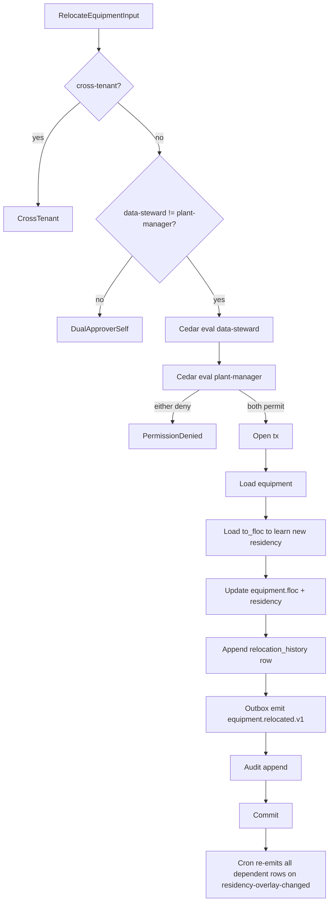

# IP-025: Equipment hierarchy advanced — Class/characteristic schema versioning + equipment-BoM + cross-plant relocation

## A. Intent

Implements the **advanced equipment hierarchy** primitives on top of IP-001:

1. **Class + Characteristic schema** (SAP `CL*` family — `KLAH`, `KSML`, `CABN`, `AUSP`) — typed, versioned attribute schemas per equipment-class. A `centrifugal_pump` class declares characteristics `MOTOR_KW: float`, `MAX_RPM: int`, `SEAL_TYPE: enum {api682_arrangement_1, ...}`, `LUBRICANT_GRADE: enum`. Equipment instances inherit characteristic shape from class.
2. **Equipment BoM** (SAP `STKO`, `STPO` joined via `IBINP` / `IB01`) — the bill-of-materials of components within a parent equipment (e.g., a pump = casing + impeller + shaft + bearings + seal + coupling). Maintenance plans can target sub-assemblies.
3. **Equipment relocation across plants** (SAP `IE4N` mass-change transaction) — moving equipment from `PLT-01` to `PLT-03` while preserving full maintenance history, residency-pack re-evaluation, and audit-trail.

Industry-precedent equivalents: SAP `CL*` Classification (used as the universal extensibility mechanism across SAP), **IBM Maximo Specification Class (SPECCLASS)**, **Infor EAM User Fields + Categories**, **Oracle Fusion Asset Attribute Sets**, **IFS Cloud Object Class + Object Attribute**, **GE Digital APM Family Manager**. Hyperscaler analog: AWS IoT TwinMaker Component Type (declarative attribute schemas tied to entity types) + Azure Digital Twins DTDL (Digital Twins Definition Language).

### A.1 Why this is non-trivial

1. **Schema evolution must preserve history.** Adding `IS_VFD_CONTROLLED: bool` to centrifugal_pump v3 mustn't break v2 readers; readers pick the schema version matching the equipment's `schema_version`.
2. **Characteristic types are typed + constrained.** `MAX_RPM` is int with bounds [100, 10000]; `LUBRICANT_GRADE` is enum from a value-list. Validation at write-time.
3. **Equipment-BoM is its own DAG.** A pump assembly may contain sub-assemblies (motor-end + drive-end); cycles forbidden.
4. **Relocation must re-evaluate residency-pack.** Moving from US-OSHA-PSM plant to EU-Seveso plant changes regulatory overlay; compliance-pack rebinds.
5. **Maintenance history preserved cross-plant.** Failure-events, MTBF, Weibull fits stay attached to equipment_id, NOT to plant. Plant transitions are HLC-ordered history events.
6. **Class inheritance hierarchy.** Class trees: `equipment → pump → centrifugal_pump → api_610_oh_pump`. Characteristic merging from ancestors.

## B. Acceptance criteria

- **AC-1:** `EquipmentClass` + `CharacteristicSchema` domain objects with versioning.
- **AC-2:** Characteristic types: `int`, `float`, `string`, `enum`, `bool`, `date`, `decimal`; per-type validation.
- **AC-3:** Class inheritance: child class merges ancestor characteristics; redefinition allowed only at child level.
- **AC-4:** Equipment-BoM domain: parent + components; DAG (no cycle); explosion + implosion queries.
- **AC-5:** Schema-version pinning at equipment row; reads pick version matching equipment's `schema_version`.
- **AC-6:** `RelocateEquipmentUseCase` moves equipment across plants atomically; rebinds residency pack; preserves history.
- **AC-7:** Cedar gate on relocation: residency-pack change requires data-steward + plant-manager dual approval.
- **AC-8:** Maintenance history attaches to equipment_id; cross-plant history queryable.
- **AC-9:** Cross-tenant load rejected.
- **AC-10:** Audit events per §D-9.

## C. Verification

```bash
cargo test -p oya-plant-maintenance-equipment-master-advanced -- class_schema_create
cargo test -p oya-plant-maintenance-equipment-master-advanced -- char_int_bounds_enforced
cargo test -p oya-plant-maintenance-equipment-master-advanced -- char_enum_value_list_enforced
cargo test -p oya-plant-maintenance-equipment-master-advanced -- class_inheritance_chain
cargo test -p oya-plant-maintenance-equipment-master-advanced -- bom_create_no_cycle
cargo test -p oya-plant-maintenance-equipment-master-advanced -- bom_explosion_returns_all
cargo test -p oya-plant-maintenance-equipment-master-advanced -- bom_implosion_returns_parents
cargo test -p oya-plant-maintenance-equipment-master-advanced -- schema_version_pinned
cargo test -p oya-plant-maintenance-equipment-master-advanced -- relocate_equipment_atomic
cargo test -p oya-plant-maintenance-equipment-master-advanced -- relocate_rebinds_residency
cargo test -p oya-plant-maintenance-equipment-master-advanced -- relocate_dual_approval_required
cargo test -p oya-plant-maintenance-equipment-master-advanced -- history_preserved_cross_plant
cargo test -p oya-plant-maintenance-equipment-master-advanced -- cross_tenant_rejected
```

## D. Detailed mechanics

### D-1. Data model

```sql
CREATE TABLE plant_maintenance.equipment_class (
    tenant_id        TEXT NOT NULL,
    class_code       TEXT NOT NULL,
    parent_class_code TEXT,
    description      TEXT NOT NULL,
    state            TEXT NOT NULL CHECK (state IN ('draft','active','retired')),
    hlc              TEXT NOT NULL,
    PRIMARY KEY (tenant_id, class_code),
    FOREIGN KEY (tenant_id, parent_class_code) REFERENCES plant_maintenance.equipment_class (tenant_id, class_code)
) PARTITION BY HASH (tenant_id);

CREATE TABLE plant_maintenance.characteristic_schema (
    tenant_id        TEXT NOT NULL,
    class_code       TEXT NOT NULL,
    schema_version   INTEGER NOT NULL,
    schema_json      JSONB NOT NULL,        -- [{ name, type, bounds, enum_values, required }]
    state            TEXT NOT NULL CHECK (state IN ('draft','active','superseded','retired')),
    superseded_by_version INTEGER,
    hlc              TEXT NOT NULL,
    decision_id      UUID NOT NULL,
    PRIMARY KEY (tenant_id, class_code, schema_version)
) PARTITION BY HASH (tenant_id);

CREATE TABLE plant_maintenance.equipment_bom (
    tenant_id        TEXT NOT NULL,
    parent_equipment_id TEXT NOT NULL,
    component_equipment_id TEXT NOT NULL,
    component_no     INTEGER NOT NULL,
    qty              NUMERIC(10,4) NOT NULL DEFAULT 1,
    unit             TEXT NOT NULL DEFAULT 'EA',
    hlc              TEXT NOT NULL,
    PRIMARY KEY (tenant_id, parent_equipment_id, component_equipment_id),
    FOREIGN KEY (tenant_id, parent_equipment_id) REFERENCES plant_maintenance.equipment (tenant_id, equipment_id),
    FOREIGN KEY (tenant_id, component_equipment_id) REFERENCES plant_maintenance.equipment (tenant_id, equipment_id)
) PARTITION BY HASH (tenant_id);

CREATE TABLE plant_maintenance.equipment_relocation_history (
    tenant_id     TEXT NOT NULL,
    equipment_id  TEXT NOT NULL,
    relocation_seq INTEGER NOT NULL,
    from_plant    TEXT NOT NULL,
    to_plant      TEXT NOT NULL,
    from_floc     TEXT NOT NULL,
    to_floc       TEXT NOT NULL,
    from_residency TEXT NOT NULL,
    to_residency   TEXT NOT NULL,
    relocated_at  TIMESTAMPTZ NOT NULL,
    data_steward  TEXT NOT NULL,
    plant_manager_approver TEXT NOT NULL,
    decision_id_chain UUID[] NOT NULL,
    hlc           TEXT NOT NULL,
    PRIMARY KEY (tenant_id, equipment_id, relocation_seq)
) PARTITION BY HASH (tenant_id);
```

### D-2. Rust types

```rust
#[derive(Debug, Clone)]
pub struct EquipmentClass {
    pub class_code:        EquipmentClass,
    pub parent_class_code: Option<EquipmentClass>,
    pub description:       String,
    pub state:             ClassState,
}

#[derive(Debug, Clone)]
pub struct CharacteristicSchema {
    pub class_code:      EquipmentClass,
    pub version:         u32,
    pub characteristics: Vec<CharacteristicDef>,
    pub state:           SchemaState,
}

#[derive(Debug, Clone)]
pub struct CharacteristicDef {
    pub name:        CharacteristicName,
    pub type_:       CharacteristicType,
    pub required:    bool,
    pub bounds:      Option<Bounds>,         // numeric only
    pub enum_values: Option<Vec<String>>,    // enum only
}

#[derive(Debug, Clone)]
pub enum CharacteristicType { Int, Float, String, Enum, Bool, Date, Decimal }

#[derive(Debug, Clone)]
pub enum Bounds {
    IntRange(i64, i64),
    FloatRange(f64, f64),
    DecimalRange(Decimal, Decimal),
}
```

### D-3. Inheritance + characteristic merge

```rust
pub async fn resolve_schema(
    tenant: &TenantId, class: &EquipmentClass,
    repo: &impl ClassRepository, version: u32,
) -> Result<CharacteristicSchema, ClassError>
{
    let mut merged = HashMap::<CharacteristicName, CharacteristicDef>::new();
    let mut current = Some(class.clone());
    while let Some(cls) = current {
        let schema = repo.load_schema(tenant, &cls, /*latest for class*/ 0).await?
            .ok_or(ClassError::ClassMissing)?;
        for ch in schema.characteristics {
            // child overrides ancestor; only insert if not already present
            merged.entry(ch.name.clone()).or_insert(ch);
        }
        let parent = repo.load_class(tenant, &cls).await?.and_then(|c| c.parent_class_code);
        current = parent;
    }
    Ok(CharacteristicSchema {
        class_code: class.clone(),
        version,
        characteristics: merged.into_values().collect(),
        state: SchemaState::Active,
    })
}
```

### D-4. Characteristic validator

```rust
pub fn validate_characteristic(def: &CharacteristicDef, value: &serde_json::Value) -> Result<(), CharError> {
    use CharacteristicType::*;
    match (def.type_.clone(), value) {
        (Int, serde_json::Value::Number(n)) => {
            let v = n.as_i64().ok_or(CharError::TypeMismatch)?;
            if let Some(Bounds::IntRange(lo, hi)) = &def.bounds {
                if v < *lo || v > *hi { return Err(CharError::OutOfBounds); }
            }
            Ok(())
        }
        (Float, serde_json::Value::Number(n)) => {
            let v = n.as_f64().ok_or(CharError::TypeMismatch)?;
            if let Some(Bounds::FloatRange(lo, hi)) = &def.bounds {
                if v < *lo || v > *hi { return Err(CharError::OutOfBounds); }
            }
            Ok(())
        }
        (Enum, serde_json::Value::String(s)) => {
            let allowed = def.enum_values.as_ref().ok_or(CharError::EnumDefMissing)?;
            if !allowed.contains(s) { return Err(CharError::EnumOutOfList); }
            Ok(())
        }
        (Bool, serde_json::Value::Bool(_)) => Ok(()),
        (String, serde_json::Value::String(_)) => Ok(()),
        (Date, serde_json::Value::String(s)) => NaiveDate::parse_from_str(s, "%Y-%m-%d").map(|_| ()).map_err(|_| CharError::DateFormat),
        (Decimal, serde_json::Value::String(s)) => Decimal::from_str(s).map(|_| ()).map_err(|_| CharError::DecimalParse),
        _ => Err(CharError::TypeMismatch),
    }
}
```

### D-5. Equipment-BoM DAG validation

```rust
pub async fn validate_bom_no_cycle(
    tenant: &TenantId, parent: &EquipmentId, new_component: &EquipmentId,
    bom_repo: &impl BomRepository,
) -> Result<(), BomError>
{
    // Walk component's ancestors; if parent appears, cycle.
    let mut stack = vec![new_component.clone()];
    let mut seen = HashSet::new();
    while let Some(node) = stack.pop() {
        if !seen.insert(node.clone()) { continue; }
        if &node == parent { return Err(BomError::CycleDetected); }
        let parents = bom_repo.implode(tenant, &node).await?;
        stack.extend(parents);
    }
    Ok(())
}
```

### D-6. Relocation use-case

```rust
#[async_trait]
impl UseCase for RelocateEquipmentUseCase<E, F, RH, C, O, A> {
    type Input = RelocateEquipmentInput;
    type Output = RelocationRef;

    async fn execute(&self, input: Self::Input, ctx: RequestContext) -> Result<RelocationRef, UseCaseError> {
        if input.tenant_id != ctx.tenant_id { return Err(UseCaseError::CrossTenant); }
        if input.data_steward_principal == input.plant_manager_principal {
            return Err(UseCaseError::DualApproverSelf);
        }
        let d1 = self.cedar.evaluate(cedar_req_relocate(&input, &input.data_steward_principal, &ctx)).await?;
        let d2 = self.cedar.evaluate(cedar_req_relocate(&input, &input.plant_manager_principal, &ctx)).await?;
        if !(d1.is_permit() && d2.is_permit()) {
            return Err(UseCaseError::PermissionDenied { reason: format!("d1={:?} d2={:?}", d1.reasons(), d2.reasons()) });
        }
        let tx = self.equipment_repo.begin_tx().await?;
        let mut eq = self.equipment_repo.load(&input.tenant_id, &input.equipment_id).await?
            .ok_or(UseCaseError::EquipmentMissing)?;
        let to_floc = self.floc_repo.load(&input.tenant_id, &input.to_floc_id).await?
            .ok_or(UseCaseError::FlocMissing)?;
        let from_plant = eq.plant_code().clone();
        let from_residency = eq.residency_pack.clone();
        let from_floc = eq.floc_id.clone();

        eq.floc_id = input.to_floc_id.clone();
        eq.residency_pack = to_floc.residency_pack.clone();   // residency rebinds!
        eq.hlc = Hlc::now();
        eq.decision_id = decision_chain_id(&d1, &d2);
        self.equipment_repo.save(&tx, &eq).await?;

        let seq = self.relocation_repo.next_seq(&tx, &input.equipment_id).await?;
        self.relocation_repo.save(&tx, &RelocationHistoryRow {
            equipment_id: input.equipment_id.clone(),
            relocation_seq: seq,
            from_plant, to_plant: to_floc.plant_code().clone(),
            from_floc, to_floc: input.to_floc_id.clone(),
            from_residency, to_residency: to_floc.residency_pack.clone(),
            relocated_at: Utc::now(),
            data_steward: input.data_steward_principal.clone(),
            plant_manager_approver: input.plant_manager_principal.clone(),
            decision_id_chain: vec![d1.id(), d2.id()],
            hlc: eq.hlc.clone(),
        }).await?;

        self.outbox.append(&tx, &equipment_relocated_event(&eq, seq)).await?;
        self.audit.emit(&tx, AuditEntry::equipment_relocated(&eq, &d1, &d2)).await?;
        tx.commit().await?;
        Ok(RelocationRef { equipment_id: eq.equipment_id, seq })
    }
}
```

### D-7. Cedar context (relocate equipment)

```jsonc
{
  "principal": "oyatie::tenant::acme::user::data-steward-9",
  "action":    "plant_maintenance::equipment::relocate",
  "resource":  "plant_maintenance::equipment::EQ-PUMP-0042",
  "context": {
    "tenant_id": "acme",
    "from_plant": "PLT-HOUS-01",
    "to_plant":   "PLT-ANTWERP-03",
    "from_residency": "global+us-osha-psm",
    "to_residency":   "global+eu-seveso",
    "second_approver_principal": "oyatie::tenant::acme::user::plant-manager-eu-12",
    "second_approver_role": "plant_manager",
    "abc_criticality": "A",
    "residency_pack": "global+eu-seveso",
    "policy_bundle_version": "2026.05.20-r3",
    "byok_mode": "platform_default"
  }
}
```

### D-8. Workflow



### D-9. AsyncAPI envelopes

| Channel | Trigger | Consumers |
|---|---|---|
| `plant-maintenance.equipment-class.created.v1` | new class | ontology, audit |
| `plant-maintenance.equipment-class.schema-published.v1` | new schema version | dependent equipment readers |
| `plant-maintenance.equipment-bom.changed.v1` | BoM add/remove | spare-parts master, planner |
| `plant-maintenance.equipment.relocated.v1` | relocation commit | ontology, compliance, predictive (re-anchor signal) |
| `plant-maintenance.equipment.residency-overlay-changed.v1` | residency rebind | compliance, audit |

### D-10. SLO targets

| Operation | p50 | p95 | p99 |
|---|---|---|---|
| Create class | 12 ms | 28 ms | 60 ms |
| Publish schema version | 28 ms | 65 ms | 130 ms |
| Validate characteristic | 0.2 ms | 0.5 ms | 1.2 ms |
| BoM add component (with cycle check) | 25 ms | 60 ms | 120 ms |
| BoM explosion (depth 5) | 35 ms | 80 ms | 160 ms |
| BoM implosion (depth 5) | 30 ms | 70 ms | 140 ms |
| Relocate equipment (single, dual-approver) | 90 ms | 200 ms | 400 ms |
| Relocate equipment (subtree of 100) | 6 s | 14 s | 30 s |

### D-11. Audit-event registry

| Event class | Severity | Emitter |
|---|---|---|
| `EVT-PLANT_MAINTENANCE-CLASS-CREATED` | informational | usecase |
| `EVT-PLANT_MAINTENANCE-CLASS-SCHEMA_PUBLISHED` | informational | usecase |
| `EVT-PLANT_MAINTENANCE-CHARACTERISTIC-OUT_OF_BOUNDS_REJECTED` | warning | usecase |
| `EVT-PLANT_MAINTENANCE-CHARACTERISTIC-ENUM_OUT_OF_LIST_REJECTED` | warning | usecase |
| `EVT-PLANT_MAINTENANCE-BOM-CYCLE_REJECTED` | warning | usecase |
| `EVT-PLANT_MAINTENANCE-BOM-COMPONENT_ADDED` | informational | usecase |
| `EVT-PLANT_MAINTENANCE-EQUIPMENT-RELOCATED` | informational | usecase |
| `EVT-PLANT_MAINTENANCE-EQUIPMENT-RESIDENCY_OVERLAY_CHANGED` | informational | usecase |
| `EVT-PLANT_MAINTENANCE-EQUIPMENT-RELOCATION_DUAL_APPROVER_SELF` | warning | usecase |
| `EVT-PLANT_MAINTENANCE-EQUIPMENT-CROSS_TENANT_REJECTED` | security | usecase |

### D-12. Failure modes & recovery

1. **`SchemaIncompatibleWithExistingInstances`** — new schema version removes a required characteristic. Reject publish; reliability engineer plans migration. Runbook `runbooks/schema-incompatible.md`.
2. **`BomCycleAttempted`** — A → B → A. Reject; data steward reviews. Runbook `runbooks/bom-cycle.md`.
3. **`RelocationViolatesResidency`** — moving from EU pack to US pack might breach GDPR for personal-data attached. Cedar denies; legal review. Runbook `runbooks/relocation-residency-breach.md`.
4. **`MaintenanceHistoryDriftPostRelocation`** — KPI rollups stale after move. Trigger refresh; alert until refreshed. Runbook `runbooks/post-relocation-kpi.md`.
5. **`InheritanceCycle`** — class A → B → A. Reject at class-create time. Runbook `runbooks/inheritance-cycle.md`.
6. **`CharacteristicValueListRetired`** — enum value retired but existing equipment uses it. Schema migration plan required before retirement. Runbook `runbooks/enum-retirement.md`.

### D-13. Migration notes

Sources: SAP `KLAH` (class header), `KSML` (class-characteristic), `CABN` (characteristic), `AUSP` (instance value), `STKO/STPO` (BoM), `IBINP` (equipment-BoM linkage), `IE4N` mass-change. IBM Maximo `SPECCLASS` + `ASSETSPEC` for attribute schemas; Infor EAM `R5USERFIELDS` for custom fields.

### D-14. Cross-µservice handoffs

| Direction | Counterparty | Surface |
|---|---|---|
| outbound | `ontology` | class + schema + bom + relocation projection |
| outbound | `compliance` | AsyncAPI on residency-overlay-changed |
| outbound | `predictive-maintenance` (IP-020) | re-anchor signals on relocation |
| outbound | `kpi-scorecard` (IP-023) | trigger rollup refresh after move |
| outbound | `audit-chain` | per ADR-0263 |
| inbound | `oya-cloud-finops` | cost-center rebind on relocation |

## E. Failure-mode summary

See D-12.

## F. Migration / rollback

Schema versions are forward-only; old versions queryable for 7 years (regulatory). Relocation history is forward-only; reverse-relocation is a new relocation event.

## G. References

- ADR-0105, ADR-0244, ADR-0252, ADR-0263, ADR-0294, ADR-0297, ADR-0314..0316.
- SAP `CL02/CL03/CL04`, `KLAH/KSML/CABN/AUSP`, `IB01/IB02`, `IE4N` documentation.
- DTDL (Azure Digital Twins Definition Language) v2.
- AWS IoT TwinMaker Component Type schemas.
- Benchmarks: SAP CL* + STKO/STPO + IE4N | IBM Maximo SPECCLASS | Infor EAM R5USERFIELDS | Oracle Fusion Asset Attribute Sets | IFS Cloud Object Class + Object Attribute | GE Digital APM Family Manager.

## H. Out of scope

- Basic equipment master (IP-001/007), maintenance plan (IP-002/008), KPI scorecard (IP-023), MTBF (IP-022), CBM signals (IP-020).

— end IP-025 —
