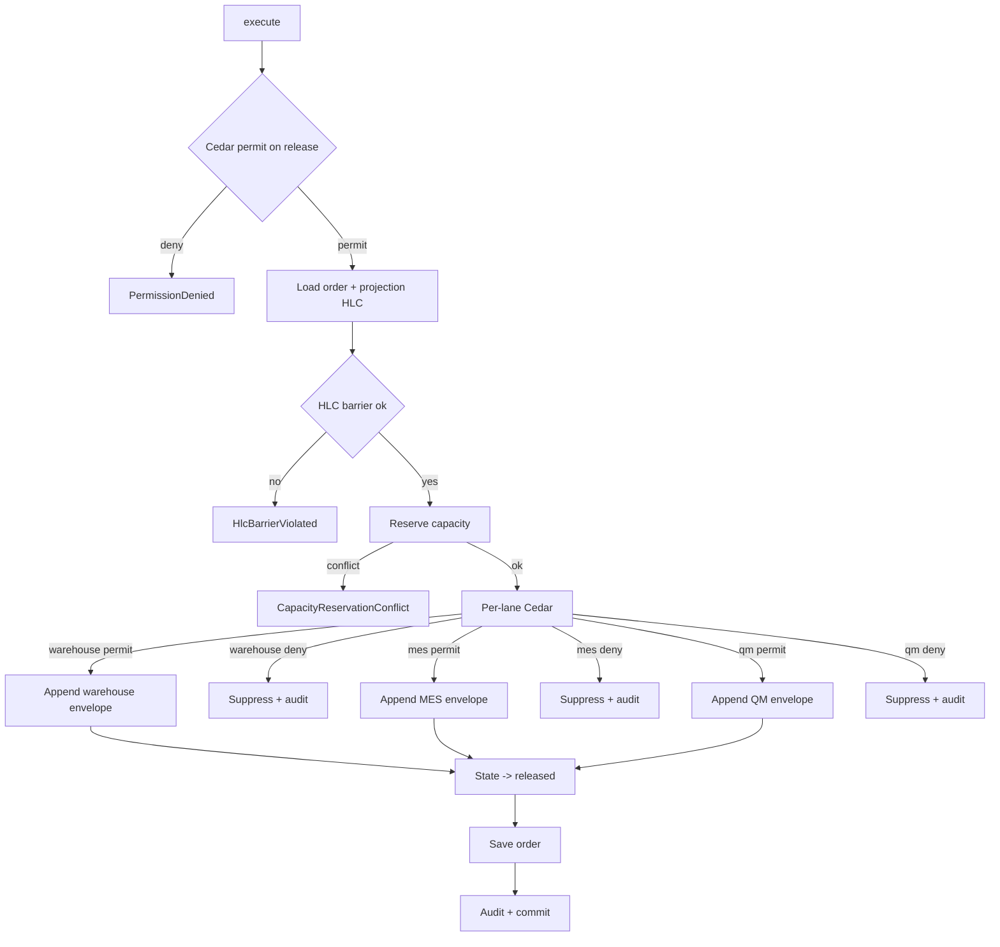

# IP-012: Usecase layer for shop-floor-release

## A. Intent

Wires the pure `ShopFloorRelease` aggregate from IP-006 to the orchestration ports. The shop-floor-release usecase is the **transactional checkpoint** at which a production order leaves the planning surface and enters execution — it commits capacity reservation, kicks the warehouse staging request, signals MES, and stamps a Cedar-audited transition. SAP transactions covered: `COR1` (process-order release for repetitive manufacturing), `CO02` action `release`, `MFBF` (backflush confirmation for REM), and `CO40` (planned→production conversion + release). Oracle Fusion equivalent is `Dispatch List` + `Work Order release`; Dynamics 365 SCM uses `Release production order` action; NetSuite uses `Release` on Work Order.

### A.1 Why orchestration here is non-trivial

Release is a distributed-transaction-shaped event that fans out to ≥3 downstream µservices. Naïve implementation creates dual-write hazards. The usecase enforces:

1. **Outbox-pattern atomicity** — DB state + AsyncAPI envelope inserted in same Postgres tx; envelope drained by separate dispatcher (ADR-0294).
2. **HLC barrier** — the release event's HLC must dominate the order's last-mutation HLC AND the capacity calendar's projection HLC, ensuring readers see consistent causal history (ADR-0297).
3. **Cedar gate on EACH downstream lane** — release-to-warehouse, release-to-MES, release-to-quality each evaluate a separate Cedar context; permit on order release does NOT auto-permit downstream lanes.
4. **Backflush flag handling** — REM orders (PP-REM) skip per-operation confirm and backflush components at completion; the release must include `backflush: true` in its envelope so warehouse staging schedules differently.
5. **Mass-release** — `COR1` style mass operations may release N orders in a batch; usecase exposes `ReleaseBatchUseCase` that retains per-order Cedar evaluation but a single batch-level decision_id for audit-trail compaction.

## B. Acceptance criteria

- **AC-1:** `ReleaseShopFloorUseCase::execute(order_id)` Cedar-gated; default deny preserved; idempotent on `(tenant_id, order_id, release_attempt_no)`.
- **AC-2:** `ReleaseBatchUseCase::execute(batch)` per-order Cedar eval; batch-level decision_id ties the audit; one Postgres tx per order (batch is not a single tx — failure of order N does NOT abort orders 1..N-1).
- **AC-3:** Outbox envelopes for `warehouse`, `mes`, `quality-management` each appended in the same Postgres tx as the order state mutation.
- **AC-4:** `backflush` flag carried verbatim from order's production-version through to envelope payload.
- **AC-5:** HLC barrier: `release.hlc > max(order.hlc, calendar.projection_hlc)`; violated → `HlcBarrierViolated` error and release aborted.
- **AC-6:** Capacity-reservation port called with retry-able `idempotency_key = (order_id, attempt_no)`.
- **AC-7:** Audit emission per ADR-0263; security audit on Cedar deny.
- **AC-8:** State transition `released → in_progress` only on first operation confirm — release itself ends in state `released`.

## C. Verification

```bash
cargo test -p oya-production-planning-shop-floor-usecase -- release_happy_path
cargo test -p oya-production-planning-shop-floor-usecase -- release_idempotent_same_attempt
cargo test -p oya-production-planning-shop-floor-usecase -- release_batch_partial_failure
cargo test -p oya-production-planning-shop-floor-usecase -- release_hlc_barrier_violated
cargo test -p oya-production-planning-shop-floor-usecase -- release_backflush_flag_propagated
cargo test -p oya-production-planning-shop-floor-usecase -- release_warehouse_envelope_schema
cargo test -p oya-production-planning-shop-floor-usecase -- release_mes_envelope_schema
cargo test -p oya-production-planning-shop-floor-usecase -- release_cedar_deny_per_lane
cargo test -p oya-production-planning-shop-floor-usecase -- cross_tenant_load_rejected
cargo test -p oya-production-planning-shop-floor-usecase -- mass_release_decision_id_threading
cargo test -p oya-production-planning-shop-floor-contract -- asyncapi_release_envelope_schema
```

## D. Detailed mechanics

### D-1. Use-case structs

```rust
pub struct ReleaseShopFloorUseCase<R, C, K, O, A> {
    repo: R, cedar: C, capacity: K, outbox: O, audit: A,
}

pub struct ReleaseBatchUseCase<R, C, K, O, A> {
    inner: ReleaseShopFloorUseCase<R, C, K, O, A>,
}
```

### D-2. Release pipeline (single order)

```rust
impl<R, C, K, O, A> ReleaseShopFloorUseCase<R, C, K, O, A>
where R: OrderRepository, C: CedarEvaluator, K: CapacityReservationPort,
      O: OutboxDispatcher, A: AuditEmitter,
{
    pub async fn execute(&self, input: ReleaseInput) -> Result<ReleaseOutput, UseCaseError> {
        // 1. Cedar gate
        let decision = self.cedar.evaluate(cedar_req_release(&input)).await?;
        if !decision.is_permit() { return Err(UseCaseError::PermissionDenied { reason: decision.reasons() }); }

        // 2. Load order + projection HLC
        let tx = self.repo.begin_tx().await?;
        let mut order = self.repo.load_for_update(&tx, &input.tenant_id, &input.order_id).await?
            .ok_or(UseCaseError::NotFound)?;
        let calendar_hlc = self.capacity.projection_hlc(&input.tenant_id, &order.work_center_plan()).await?;

        // 3. HLC barrier
        let release_hlc = Hlc::now().max(order.hlc().next()).max(calendar_hlc.next());
        if !release_hlc.dominates(&order.hlc()) || !release_hlc.dominates(&calendar_hlc) {
            return Err(UseCaseError::HlcBarrierViolated);
        }

        // 4. Reserve capacity
        let reservation = self.capacity.reserve(
            &tx, &input.tenant_id, &order.work_center_plan(),
            ReservationIdempotencyKey::new(&input.order_id, input.attempt_no), &decision).await?;

        // 5. Append outbox envelopes (per downstream lane, each Cedar-gated)
        for lane in [DownstreamLane::Warehouse, DownstreamLane::Mes, DownstreamLane::QualityManagement] {
            let lane_decision = self.cedar.evaluate(cedar_req_lane(&input, lane)).await?;
            if lane_decision.is_permit() {
                self.outbox.append(&tx, &shop_floor_release_envelope(&order, &reservation, lane, &lane_decision, release_hlc)).await?;
            } else {
                // suppress this lane only; surface in audit
                self.audit.emit(&tx, AuditEntry::lane_suppressed(&order, lane, &lane_decision)).await?;
            }
        }

        // 6. State transition + persist
        order.transition_to_released(reservation.id(), release_hlc)?;
        self.repo.save(&tx, &order).await?;
        self.audit.emit(&tx, AuditEntry::release(&order, &decision)).await?;

        tx.commit().await?;
        Ok(ReleaseOutput {
            decision_id: decision.decision_id,
            reservation_id: reservation.id(),
            release_hlc,
            lanes_emitted: vec![/* populated above */],
        })
    }
}
```

### D-3. Batch release semantics

```rust
pub async fn execute_batch(&self, batch: ReleaseBatch) -> ReleaseBatchOutput {
    let mut outcomes = Vec::with_capacity(batch.order_ids.len());
    let batch_decision_id = uuid::Uuid::new_v4().into();
    for order_id in &batch.order_ids {
        let single = ReleaseInput {
            tenant_id: batch.tenant_id.clone(),
            order_id: order_id.clone(),
            attempt_no: batch.attempt_no,
            batch_decision_id: Some(batch_decision_id),
        };
        outcomes.push(self.inner.execute(single).await);
    }
    ReleaseBatchOutput { batch_decision_id, outcomes }
}
```

Per-order failure does NOT abort the batch — caller receives a vector of `Result`s.

### D-4. Port traits

```rust
#[async_trait]
pub trait CapacityReservationPort {
    async fn projection_hlc(&self, tenant: &TenantId, plan: &WorkCenterPlan) -> Result<Hlc, CapacityError>;
    async fn reserve(&self, tx: &RepoTx, tenant: &TenantId, plan: &WorkCenterPlan,
                     idempo: ReservationIdempotencyKey, decision: &CedarDecision)
        -> Result<CapacityReservation, CapacityError>;
    async fn inverse(&self, tx: &RepoTx, tenant: &TenantId, reservation_id: &ReservationId)
        -> Result<(), CapacityError>;
}
```

### D-5. Cedar context (per-lane example)

```jsonc
{
  "principal": "oyatie::tenant::acme::user::supervisor-7",
  "action":    "production_planning::shop_floor_release::publish_to_warehouse",
  "resource":  "production_planning::production_order::PO-FG-0001-9001",
  "context": {
    "tenant_id": "acme", "plant_code": "P01", "downstream_lane": "warehouse",
    "data_class": "operational", "source_system_id": "production_planning",
    "policy_bundle_version": "2026.05.20-r3", "residency_pack": "global+kr",
    "byok_mode": "platform_default", "backflush": false
  }
}
```

### D-6. Outbox envelopes (AsyncAPI 3.1.0)

| Channel | Trigger | Consumers | Carries |
|---|---|---|---|
| `production-planning.shop-floor-release.requested.v1` (lane=warehouse) | release | `warehouse` | order_id, BOM components, reservation_id, backflush |
| `production-planning.shop-floor-release.requested.v1` (lane=mes) | release | `manufacturing-execution-system` | order_id, routing snapshot, operation list |
| `production-planning.shop-floor-release.requested.v1` (lane=quality_management) | release | `quality-management` | order_id, inspection plan ref |
| `production-planning.shop-floor-release.cancelled.v1` | order cancel after release | all three above | order_id, reason |

### D-7. Workflow with decision branches



### D-8. Audit-event class registry (per ADR-0263)

| Event class | Severity | Emitter | Sink |
|---|---|---|---|
| `EVT-PRODUCTION_PLANNING-SHOP_FLOOR_RELEASE-EMITTED` | informational | usecase | `audit-events.v1` |
| `EVT-PRODUCTION_PLANNING-SHOP_FLOOR_RELEASE-LANE_SUPPRESSED` | warning | usecase | `audit-events.v1` |
| `EVT-PRODUCTION_PLANNING-SHOP_FLOOR_RELEASE-HLC_BARRIER_VIOLATED` | warning | usecase | `audit-events.v1` |
| `EVT-PRODUCTION_PLANNING-SHOP_FLOOR_RELEASE-PERMISSION_DENIED` | security | usecase | `audit-events.security.v1` |
| `EVT-PRODUCTION_PLANNING-SHOP_FLOOR_RELEASE-BATCH_COMPLETED` | informational | usecase | `audit-events.v1` |

### D-9. SLO targets

| Operation | p50 | p95 | p99 | Rationale |
|---|---|---|---|---|
| `Release` (single, all lanes permit) | 28 ms | 60 ms | 120 ms | Cedar gate × 4 + capacity reserve + 3 outbox appends + state write. |
| `Release` (warehouse-only permit) | 24 ms | 50 ms | 95 ms | Fewer outbox appends. |
| `ReleaseBatch` (10 orders) | 240 ms | 480 ms | 900 ms | Linear in N; per-order tx. |
| `ReleaseBatch` (100 orders) | 2.2 s | 4.5 s | 8.5 s | Driven by Cedar-per-order; sized for daily morning shift release. |

### D-10. Failure modes & recovery

1. **`HlcBarrierViolated`** — happens during cutover clock-skew or projection-cache lag. Tx aborts; client retries; barrier passes once projection catches up. Runbook `runbooks/hlc-barrier-violation.md`.
2. **`CapacityReservationConflict`** — slot already reserved by competing order. Tx rolls back; planner reshuffles via IP-021 capacity leveling. Runbook `runbooks/capacity-conflict.md`.
3. **`PartialLaneSuppression`** — Cedar denies warehouse lane but permits MES + QM. Release proceeds with audit annotation; downstream warehouse-team alerted. Runbook `runbooks/lane-suppression.md`.
4. **`OutboxAppendFailure`** — Postgres FAILS on outbox row insert (e.g., disk full). Tx rolls back fully; order remains `created`. Idempotency key preserved. Runbook `runbooks/outbox-append-failure.md`.
5. **`MesDuplicateRelease`** — MES retries the consume of the envelope. AsyncAPI consumer uses event_id dedupe; no double-process. Runbook `runbooks/mes-duplicate-event.md`.
6. **`BackflushFlagMismatch`** — order's production-version says backflush=true but warehouse responds with non-backflush staging. Variance event `shop-floor-release.backflush-mismatch.v1` emitted; runbook `runbooks/backflush-mismatch.md`.

### D-11. Migration notes

Source vendor surface: SAP S/4HANA tx `CO02` (release action) + `COR1` (REM release) + `MFBF` (backflush). Tables: `AFKO.GLTRP` (basic finish), `AFKO.FREIGABE` (release flag). Greenfield tenants start with empty release log. Lift-shift jobs invoke this usecase to replay historical releases idempotently — the dedupe key prevents double-emit on replay.

### D-12. Ontology projection

```rust
pub fn project_release(o: &ProductionOrder, r: &CapacityReservation) -> OntologyDelta {
    OntologyDelta::new()
        .upsert_node(NodeRef::production_order(o.tenant_id(), o.order_id()))
        .upsert_node(NodeRef::capacity_reservation(o.tenant_id(), r.id()))
        .upsert_edge(Edge::released_with_reservation(o.id(), r.id()))
        .with_state(o.state())
        .with_hlc(o.hlc())
}
```

### D-13. Cross-µservice handoffs

| Direction | Counterparty | Channel |
|---|---|---|
| outbound | `warehouse` (IP-017) | AsyncAPI `shop-floor-release.requested.v1` (lane=warehouse) |
| outbound | `manufacturing-execution-system` (IP-024) | AsyncAPI same channel (lane=mes) |
| outbound | `quality-management` | AsyncAPI same channel (lane=quality_management) |
| inbound  | `quality-management` | AsyncAPI `quality-hold.requested.v1` may cancel a not-yet-released order |
| outbound | `audit-substrate` | per ADR-0263 |

## E. Failure-mode summary

See D-10. Each scenario maps to a named runbook under `runbooks/`.

## F. Migration / rollback

Feature flag `production_planning_shop_floor_release_v1`. Disabling pauses the dispatcher (no envelopes emitted) but order state remains releasable in DB; once flag re-enabled, dispatcher drains backlog.

## G. References

- ADR-0105, ADR-0244, ADR-0263, ADR-0294, ADR-0297, ADR-0314, ADR-0315.
- SAP Help: PP-SFC `CO02` release action; PP-REM `COR1`, `MFBF`; tables `AFKO`, `AFPO`.
- Benchmarks: SAP PP-SFC/PP-REM | Oracle Fusion Manufacturing Dispatch List | Dynamics 365 SCM Release production order | NetSuite Work Order Release | Plex DemandCaster MES release.

## H. Out of scope

- Domain (IP-006), adapter (IP-013), REST surface (IP-014), warehouse handshake details (IP-017), MES bidirectional flow (IP-024).

— end IP-012 —
