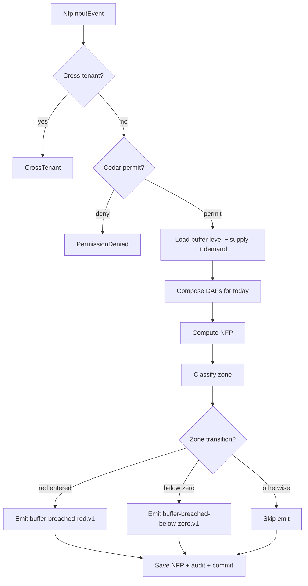

# IP-018: DDMRP buffer profile authoring + dynamic adjustment factor (DAF) recalc

## A. Intent

Implements Demand-Driven Material Requirements Planning (DDMRP) per the **Demand Driven Institute** methodology (Ptak & Smith, *Demand Driven Material Requirements Planning*, 3rd ed., 2018) — a replacement for classical MRP signals that decouples planning from forecast volatility via strategically positioned stock buffers. SAP's equivalent is `PP-DD` (Demand-Driven Replenishment, transactions `MD_DD_PLANNING`, `MD_DD_BUFFER_LEVEL`, `MD_DD_DAF_MAINTAIN`). Oracle Fusion equivalent is Demand Management Cloud DDMRP add-on (introduced 2022); Dynamics 365 SCM has the **DDMRP feature** (introduced 2021); NetSuite uses third-party DDMRP add-ons (Synchrono, Demand Driven Technologies).

### A.1 Why DDMRP is non-trivial

DDMRP defines three buffer zones (**red / yellow / green**) per part computed from five components:

```
Average Daily Usage (ADU) × Decoupled Lead Time (DLT) × Lead Time Factor (LTF) → yellow zone
Yellow × Variability Factor (VF) → red base
Red base + Red safety → red zone
Yellow × Order Cycle Factor (OCF) → green zone
Top of Red (TOR) → red zone height
Top of Yellow (TOY) = TOR + Yellow
Top of Green (TOG) = TOY + Green
```

The **Dynamic Adjustment Factor (DAF)** is a planner-authored multiplier on ADU that fires for known events (seasonality, promotion, NPI ramp) and the **Zone Adjustment Factor (ZAF)** scales the zones themselves for known transitions.

Non-trivial concerns:

1. **Buffer-profile inheritance** — buffer profiles are authored at part-class level; individual parts inherit unless overridden. Override resolution is decision-table-evaluated.
2. **DAF temporal overlap** — multiple DAFs may apply to the same part on the same day (e.g., seasonal + promotion). Composition is multiplicative; bounds (`min 0.1`, `max 5.0`) enforced.
3. **Net Flow Position (NFP) recalculation** — must run on every demand-write, supply-write, on-hand-write event; consumes Kafka topics from `sales-orders`, `inventory`, `mrp-run`.
4. **Cedar gate on buffer publish** — buffer parameters are financial-impact (working-capital implications); publish requires explicit Cedar permit (planner cannot publish without buyer-planner sign-off in default profile).
5. **EU AI Act consideration (ADR-0257)** — DDMRP's DAF/ZAF recommendations from the **AI substrate** (LLM-suggested factors based on historicals) trigger explainability records per Annex III; planner override always available.

## B. Acceptance criteria

- **AC-1:** `AuthorBufferProfileUseCase::execute` Cedar-gated; default deny preserved; idempotent on `(tenant_id, profile_id, version)`.
- **AC-2:** `InheritBufferProfileUseCase::resolve(part_id)` returns deterministic profile with override chain documented in `resolution_trace`.
- **AC-3:** `PublishBufferLevelsUseCase::execute` requires Cedar permit `production_planning::ddmrp::buffer::publish`; published levels stored with `effective_from` HLC.
- **AC-4:** `AuthorDafUseCase::execute` enforces `0.1 ≤ factor ≤ 5.0` and emits explainability record per ADR-0257 when factor derived from AI suggestion.
- **AC-5:** `RecalculateNetFlowPositionUseCase::handle(event)` runs in ≤ 25ms p95 per part; updates NFP within `(red/yellow/green)` zones.
- **AC-6:** Composed DAF on same day: multiplicative composition; final composed factor clamped to `[0.1, 5.0]`; out-of-bound clamping audited.
- **AC-7:** NFP breach into RED zone emits `ddmrp.buffer-breached-red.v1` AsyncAPI envelope → triggers planned-order generation via MRP-run (IP-008).
- **AC-8:** Buffer profile retirement transitions to `historical` state, never deleted (audit trail).
- **AC-9:** Cross-tenant defence-in-depth on all part_id loads.
- **AC-10:** Worker `ddmrp-recalc-worker` runs hourly cron PLUS on-demand on every demand/supply/inventory event.

## C. Verification

```bash
cargo test -p oya-production-planning-ddmrp-usecase -- author_buffer_profile_happy_path
cargo test -p oya-production-planning-ddmrp-usecase -- inherit_profile_override_chain
cargo test -p oya-production-planning-ddmrp-usecase -- publish_levels_requires_cedar_permit
cargo test -p oya-production-planning-ddmrp-usecase -- daf_bound_enforcement
cargo test -p oya-production-planning-ddmrp-usecase -- daf_multiplicative_composition
cargo test -p oya-production-planning-ddmrp-usecase -- daf_explainability_record_emitted
cargo test -p oya-production-planning-ddmrp-usecase -- nfp_recalc_on_demand_event
cargo test -p oya-production-planning-ddmrp-usecase -- nfp_breach_red_emits_event
cargo test -p oya-production-planning-ddmrp-usecase -- buffer_retirement_state_change
cargo test -p oya-production-planning-ddmrp-usecase -- cross_tenant_load_rejected
cargo test -p oya-production-planning-ddmrp-contract -- asyncapi_buffer_breached_envelope_schema
```

## D. Detailed mechanics

### D-1. Data model (PostgreSQL)

```sql
CREATE TABLE production_planning.ddmrp_buffer_profile (
    tenant_id          TEXT NOT NULL,
    profile_id          TEXT NOT NULL,
    version             INTEGER NOT NULL,
    part_class          TEXT NOT NULL,
    item_type           TEXT NOT NULL CHECK (item_type IN ('purchased','manufactured','distributed','intermediate')),
    lead_time_category  TEXT NOT NULL CHECK (lead_time_category IN ('short','medium','long')),
    variability_category TEXT NOT NULL CHECK (variability_category IN ('low','medium','high')),
    lead_time_factor    NUMERIC(4,3) NOT NULL,
    variability_factor  NUMERIC(4,3) NOT NULL,
    order_cycle_factor  NUMERIC(4,3) NOT NULL,
    red_safety_factor   NUMERIC(4,3) NOT NULL,
    minimum_order_qty   NUMERIC(18,4),
    state               TEXT NOT NULL CHECK (state IN ('draft','active','historical')),
    hlc                 TEXT NOT NULL,
    decision_id         UUID NOT NULL,
    effective_from      TIMESTAMPTZ NOT NULL,
    PRIMARY KEY (tenant_id, profile_id, version)
) PARTITION BY HASH (tenant_id);

CREATE TABLE production_planning.ddmrp_buffer_level (
    tenant_id      TEXT NOT NULL,
    part_id        TEXT NOT NULL,
    location_id    TEXT NOT NULL,
    profile_id     TEXT NOT NULL,
    profile_version INTEGER NOT NULL,
    adu            NUMERIC(18,4) NOT NULL,
    decoupled_lead_time_days INTEGER NOT NULL,
    red_zone_qty   NUMERIC(18,4) NOT NULL,
    yellow_zone_qty NUMERIC(18,4) NOT NULL,
    green_zone_qty NUMERIC(18,4) NOT NULL,
    top_of_red     NUMERIC(18,4) NOT NULL,
    top_of_yellow  NUMERIC(18,4) NOT NULL,
    top_of_green   NUMERIC(18,4) NOT NULL,
    last_calculated_at TIMESTAMPTZ NOT NULL,
    hlc            TEXT NOT NULL,
    PRIMARY KEY (tenant_id, part_id, location_id)
) PARTITION BY HASH (tenant_id);

CREATE TABLE production_planning.ddmrp_daf (
    tenant_id      TEXT NOT NULL,
    daf_id         TEXT NOT NULL,
    part_id        TEXT NOT NULL,
    location_id    TEXT NOT NULL,
    factor         NUMERIC(4,3) NOT NULL CHECK (factor BETWEEN 0.1 AND 5.0),
    reason_code    TEXT NOT NULL,
    reason_detail  TEXT,
    valid_from     TIMESTAMPTZ NOT NULL,
    valid_to       TIMESTAMPTZ NOT NULL,
    authored_by    TEXT NOT NULL,
    ai_suggested   BOOLEAN NOT NULL DEFAULT FALSE,
    explainability_record_id UUID,
    hlc            TEXT NOT NULL,
    decision_id    UUID NOT NULL,
    PRIMARY KEY (tenant_id, daf_id)
) PARTITION BY HASH (tenant_id);

CREATE TABLE production_planning.ddmrp_net_flow_position (
    tenant_id     TEXT NOT NULL,
    part_id       TEXT NOT NULL,
    location_id   TEXT NOT NULL,
    on_hand       NUMERIC(18,4) NOT NULL,
    open_supply   NUMERIC(18,4) NOT NULL,
    qualified_demand NUMERIC(18,4) NOT NULL,
    nfp           NUMERIC(18,4) GENERATED ALWAYS AS (on_hand + open_supply - qualified_demand) STORED,
    zone          TEXT NOT NULL CHECK (zone IN ('over_green','green','yellow','red','below_zero')),
    last_calculated_at TIMESTAMPTZ NOT NULL,
    hlc           TEXT NOT NULL,
    PRIMARY KEY (tenant_id, part_id, location_id)
) PARTITION BY HASH (tenant_id);
```

### D-2. Rust types

```rust
#[derive(Debug, Clone)]
pub struct BufferProfile {
    pub tenant_id: TenantId,
    pub profile_id: ProfileId,
    pub version: u32,
    pub part_class: PartClass,
    pub item_type: ItemType,
    pub lead_time_category: LeadTimeCategory,
    pub variability_category: VariabilityCategory,
    pub lead_time_factor: Decimal,
    pub variability_factor: Decimal,
    pub order_cycle_factor: Decimal,
    pub red_safety_factor: Decimal,
    pub minimum_order_qty: Option<Decimal>,
    pub state: ProfileState,
    pub hlc: Hlc,
    pub decision_id: DecisionId,
}

#[derive(Debug, Clone)]
pub struct BufferLevel {
    pub adu: Decimal,
    pub dlt_days: u32,
    pub red_zone_qty: Decimal,
    pub yellow_zone_qty: Decimal,
    pub green_zone_qty: Decimal,
    pub top_of_red: Decimal,
    pub top_of_yellow: Decimal,
    pub top_of_green: Decimal,
}

impl BufferLevel {
    pub fn compute(adu: Decimal, dlt_days: u32, p: &BufferProfile) -> Self {
        let yellow = adu * Decimal::from(dlt_days);
        let red_base = yellow * p.variability_factor;
        let red_safety = red_base * p.red_safety_factor;
        let red = red_base + red_safety;
        let green = yellow * p.order_cycle_factor;
        BufferLevel {
            adu, dlt_days,
            red_zone_qty: red, yellow_zone_qty: yellow, green_zone_qty: green,
            top_of_red: red,
            top_of_yellow: red + yellow,
            top_of_green: red + yellow + green,
        }
    }
}
```

### D-3. DAF composition (multiplicative)

```rust
pub fn compose_dafs_on_day(dafs: &[Daf], day: NaiveDate) -> Decimal {
    let applicable = dafs.iter().filter(|d| d.valid_from.date() <= day && day <= d.valid_to.date());
    let raw = applicable.fold(Decimal::ONE, |acc, d| acc * d.factor);
    raw.clamp(Decimal::new(1, 1), Decimal::new(5, 0))  // [0.1, 5.0]
}
```

### D-4. Net Flow Position recalc usecase

```rust
pub struct RecalculateNetFlowPositionUseCase<R, C, O, A> {
    repo: R, cedar: C, outbox: O, audit: A,
}

impl<R, C, O, A> RecalculateNetFlowPositionUseCase<R, C, O, A>
where R: NfpRepository, C: CedarEvaluator, O: OutboxDispatcher, A: AuditEmitter,
{
    pub async fn handle(&self, ev: NfpInputEvent) -> Result<(), UseCaseError> {
        if ev.tenant_id != ev.part.tenant_id { return Err(UseCaseError::CrossTenant); }
        let decision = self.cedar.evaluate(cedar_req_nfp(&ev)).await?;
        if !decision.is_permit() { return Err(UseCaseError::PermissionDenied { reason: decision.reasons() }); }

        let tx = self.repo.begin_tx().await?;
        let level = self.repo.load_buffer_level(&tx, &ev.tenant_id, &ev.part_id, &ev.location_id).await?
            .ok_or(UseCaseError::NotFound)?;
        let demand = self.repo.qualified_demand(&tx, &ev.tenant_id, &ev.part_id, &ev.location_id).await?;
        let supply = self.repo.open_supply(&tx, &ev.tenant_id, &ev.part_id, &ev.location_id).await?;
        let nfp = ev.on_hand + supply - demand;
        let zone = classify_zone(nfp, &level);

        let prior_zone = self.repo.last_zone(&tx, &ev.tenant_id, &ev.part_id, &ev.location_id).await?;
        self.repo.save_nfp(&tx, &Nfp { nfp, zone, ..ev.clone().into() }).await?;

        if zone == Zone::Red && prior_zone != Some(Zone::Red) {
            self.outbox.append(&tx, &buffer_breached_red_event(&ev, nfp, &decision)).await?;
            self.audit.emit(&tx, AuditEntry::breach_red(&ev, nfp, &decision)).await?;
        }
        tx.commit().await?;
        Ok(())
    }
}

fn classify_zone(nfp: Decimal, lvl: &BufferLevel) -> Zone {
    if      nfp < Decimal::ZERO        { Zone::BelowZero }
    else if nfp <= lvl.top_of_red      { Zone::Red }
    else if nfp <= lvl.top_of_yellow   { Zone::Yellow }
    else if nfp <= lvl.top_of_green    { Zone::Green }
    else                                { Zone::OverGreen }
}
```

### D-5. Port traits

```rust
#[async_trait]
pub trait BufferProfileRepository {
    async fn save_profile(&self, tx: &RepoTx, p: &BufferProfile) -> Result<(), RepoError>;
    async fn load_profile_by_part_class(&self, tenant: &TenantId, class: &PartClass) -> Result<Option<BufferProfile>, RepoError>;
}

#[async_trait]
pub trait DafRepository {
    async fn save_daf(&self, tx: &RepoTx, d: &Daf) -> Result<(), RepoError>;
    async fn list_active_dafs(&self, tenant: &TenantId, part: &PartId, day: NaiveDate) -> Result<Vec<Daf>, RepoError>;
}

#[async_trait]
pub trait NfpRepository {
    async fn save_nfp(&self, tx: &RepoTx, n: &Nfp) -> Result<(), RepoError>;
    async fn qualified_demand(&self, tx: &RepoTx, tenant: &TenantId, part: &PartId, loc: &LocationId) -> Result<Decimal, RepoError>;
    async fn open_supply(&self, tx: &RepoTx, tenant: &TenantId, part: &PartId, loc: &LocationId) -> Result<Decimal, RepoError>;
    async fn load_buffer_level(&self, tx: &RepoTx, tenant: &TenantId, part: &PartId, loc: &LocationId) -> Result<Option<BufferLevel>, RepoError>;
    async fn last_zone(&self, tx: &RepoTx, tenant: &TenantId, part: &PartId, loc: &LocationId) -> Result<Option<Zone>, RepoError>;
}
```

### D-6. Cedar context (publish + AI explainability)

```jsonc
{
  "principal": "oyatie::tenant::acme::user::ddmrp-planner-2",
  "action":    "production_planning::ddmrp::buffer::publish",
  "resource":  "production_planning::ddmrp::buffer_level::FG-0001:P01",
  "context": {
    "tenant_id": "acme", "plant_code": "P01",
    "data_class": "operational", "ai_suggested": false,
    "policy_bundle_version": "2026.05.20-r3", "residency_pack": "global+kr",
    "byok_mode": "platform_default"
  }
}
```

### D-7. AsyncAPI envelopes

| Channel | Trigger | Consumers |
|---|---|---|
| `production-planning.ddmrp.buffer-profile-published.v1` | profile publish | `mrp-run` (caches), `analytics` |
| `production-planning.ddmrp.buffer-levels-recalculated.v1` | levels recalc | `mrp-run`, `dashboards` |
| `production-planning.ddmrp.daf-authored.v1` | DAF author | `mrp-run`, `audit` |
| `production-planning.ddmrp.buffer-breached-red.v1` | NFP enters red | `mrp-run` (creates planned order), `alerting` |
| `production-planning.ddmrp.buffer-breached-below-zero.v1` | NFP < 0 | `mrp-run` (urgent order), `alerting` (P1) |

### D-8. Workflow with decision branches



### D-9. SLO targets

| Operation | p50 | p95 | p99 | Rationale |
|---|---|---|---|---|
| `AuthorBufferProfile` | 16 ms | 38 ms | 75 ms | Cedar + DB write + outbox. |
| `PublishBufferLevels` (single part) | 14 ms | 32 ms | 65 ms | Recompute + write level. |
| `RecalculateNetFlowPosition` (single part) | 11 ms | 25 ms | 50 ms | Tight loop — bottleneck for high-frequency tenants. |
| `RecalculateNetFlowPosition` (batch 1000 parts) | 1.2 s | 2.5 s | 4.5 s | Hourly cron throughput. |
| `AuthorDaf` (AI-suggested) | 22 ms | 50 ms | 100 ms | Includes explainability record emission. |

### D-10. Audit-event class registry

| Event class | Severity | Emitter |
|---|---|---|
| `EVT-PRODUCTION_PLANNING-DDMRP-BUFFER_PROFILE_AUTHORED` | informational | usecase |
| `EVT-PRODUCTION_PLANNING-DDMRP-BUFFER_LEVELS_PUBLISHED` | informational | usecase |
| `EVT-PRODUCTION_PLANNING-DDMRP-DAF_AUTHORED` | informational | usecase |
| `EVT-PRODUCTION_PLANNING-DDMRP-DAF_AI_SUGGESTED` | informational | usecase (Annex III explainability) |
| `EVT-PRODUCTION_PLANNING-DDMRP-DAF_CLAMPED` | warning | usecase |
| `EVT-PRODUCTION_PLANNING-DDMRP-BUFFER_BREACHED_RED` | warning | usecase |
| `EVT-PRODUCTION_PLANNING-DDMRP-BUFFER_BREACHED_BELOW_ZERO` | critical | usecase |
| `EVT-PRODUCTION_PLANNING-DDMRP-PERMISSION_DENIED` | security | usecase |

### D-11. Failure modes & recovery

1. **`DafBoundExceeded`** — caller submits factor > 5.0; clamped to 5.0; `EVT-…-DAF_CLAMPED` emitted; caller notified. Runbook `runbooks/daf-clamped.md`.
2. **`BufferProfileMissing`** — NFP recalc for part with no profile; falls back to `default-profile` per part-class; alert if part lacks even default. Runbook `runbooks/buffer-profile-missing.md`.
3. **`NfpEventStorm`** — high-frequency demand changes (e.g., e-commerce flash sale); batching window 5s suppresses redundant recalcs while preserving final state.
4. **`AdduEstimateUnreliable`** — ADU computed over <30 days of data; flag `low_confidence`; UI shows warning; runbook `runbooks/adu-low-confidence.md`.
5. **`ExplainabilityRecordEmissionFailed`** — AI-suggested DAF write succeeds but explainability emission fails; tx rolled back per ADR-0257 atomicity requirement.
6. **`PolicyBundleStale`** — Cedar evaluator using stale bundle. Detected via heartbeat; alert fires; bundle hot-swap re-attempts.

### D-12. Migration notes

Source vendor surface: SAP `PP-DD` tables `DDMRP_BUFFER`, `DDMRP_BUFFER_LEVEL`, `DDMRP_DAF`; transactions `MD_DD_PLANNING`, `MD_DD_BUFFER_LEVEL`, `MD_DD_DAF_MAINTAIN`. Greenfield tenants seed default profiles per part-class. Lift-shift via migration adapter writes through this usecase (per ADR-0247).

### D-13. Ontology projection

```rust
pub fn project_buffer_level(b: &BufferLevel, part: &PartId, loc: &LocationId, tenant: &TenantId) -> OntologyDelta {
    OntologyDelta::new()
        .upsert_node(NodeRef::ddmrp_buffer(tenant.clone(), part.clone(), loc.clone()))
        .upsert_edge(Edge::buffer_for_part(tenant.clone(), part.clone(), loc.clone()))
        .with_attrs([("top_of_red", b.top_of_red), ("top_of_yellow", b.top_of_yellow), ("top_of_green", b.top_of_green)])
        .with_hlc(Hlc::now())
}
```

### D-14. Cross-µservice handoffs

| Direction | Counterparty | Channel |
|---|---|---|
| inbound  | `sales-orders` | AsyncAPI `sales-order.confirmed.v1` (drives qualified demand) |
| inbound  | `inventory`    | AsyncAPI `inventory.on-hand-changed.v1` |
| inbound  | `mrp-run`      | AsyncAPI `mrp-run.planned-order-created.v1` (drives open supply) |
| inbound  | `ai-substrate` | gRPC `ai_substrate.v1.SuggestDaf` (Annex III) |
| outbound | `mrp-run`      | AsyncAPI `ddmrp.buffer-breached-red.v1` (triggers planned-order generation) |
| outbound | `dashboards`   | AsyncAPI `ddmrp.buffer-levels-recalculated.v1` |
| outbound | `audit-substrate` | per ADR-0263 |

## E. Failure-mode summary

See D-11.

## F. Migration / rollback

Feature flag `production_planning_ddmrp_v1`. Disabling stops the recalc worker; published buffer levels remain available read-only.

## G. References

- ADR-0105, ADR-0244, ADR-0257 (EU AI Act explainability), ADR-0263, ADR-0294, ADR-0297, ADR-0315.
- Demand Driven Institute methodology canon: Ptak & Smith, *Demand Driven Material Requirements Planning* (3rd ed., Industrial Press, 2018).
- SAP S/4HANA Manufacturing for Demand-Driven Replenishment (`PP-DD`).
- Benchmarks: SAP PP-DD | Oracle Demand Management Cloud DDMRP | Dynamics 365 SCM DDMRP feature | Synchrono DDMRP add-on | Demand Driven Technologies Replenishment+.

## H. Out of scope

- Classical MRP (IP-002/IP-008), S&OP horizon (IP-019), capacity leveling (IP-021), MES handshake (IP-024).

— end IP-018 —
