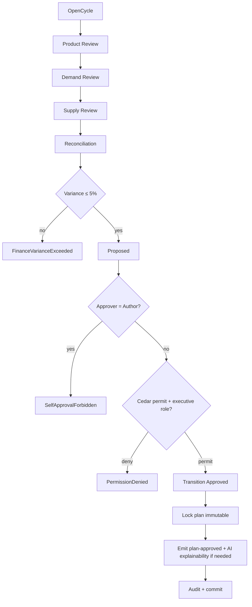

# IP-019: S&OP horizon — Sales-and-Operations Planning monthly cycle with executive sign-off Cedar gate

## A. Intent

Implements the **Sales-and-Operations Planning (S&OP)** monthly executive cycle as canonicalized by Oliver Wight (the Wight five-step model: *Product Review → Demand Review → Supply Review → Reconciliation → Management Business Review*) and operationalized in SAP via the `PP-SOP` module (transactions `MC81-MC95`) and SAP IBP (Integrated Business Planning) for cloud-deployments. Oracle equivalent: Oracle S&OP Cloud Service; Dynamics 365 equivalent: Dynamics 365 Supply Chain Management Planning Optimization; NetSuite equivalent: NetSuite Planning & Budgeting Cloud Service S&OP module.

### A.1 Why S&OP differs from MRP and DDMRP

| Horizon | MRP | DDMRP | S&OP |
|---|---|---|---|
| Time-fence | hours-to-weeks | days-to-weeks | **months-to-quarters (3-18mo)** |
| Granularity | part-level | part-buffer | **product-family + business-unit** |
| Inputs | demand + BOM + routing | demand + buffer + DLT | **aggregate forecast + capacity envelope + financial plan** |
| Outputs | planned orders | buffer breaches | **monthly volume + revenue plan per family** |
| Governance | planner | planner | **executive sign-off (CEO / COO / CFO)** |

The S&OP usecase is therefore *not* an order-generator; it is a **monthly consensus engine** that produces a single approved plan that constrains all downstream MRP/DDMRP/scheduling runs for the next horizon.

### A.2 Cedar gate on executive sign-off

The most distinctive feature of the S&OP usecase: **transition from `proposed` → `approved` requires a Cedar permit by a principal in the `executive-sponsor` role, scoped to the `s_and_op` resource**. Default Cedar bundle forbids self-approval (the planner who authored the proposal MUST NOT be the approver — separation of duties).

### A.3 Wight five-step model implementation

```
1. Product Review        -> ReviewNewProductIntroductionsUseCase (NPI)
2. Demand Review         -> ReviewDemandConsensusUseCase (consensus across sales/marketing)
3. Supply Review         -> ReviewSupplyConstraintsUseCase (capacity envelope + materials)
4. Reconciliation        -> ReconcileFinanceVsOperationsUseCase
5. Management Business Review -> ApproveSopPlanUseCase (Cedar-gated; executive signoff)
```

## B. Acceptance criteria

- **AC-1:** `OpenSopCycleUseCase::execute(cycle_id, horizon_months)` Cedar-gated; horizon 3..18 months only.
- **AC-2:** Each of the 5 Wight steps has a dedicated usecase + audit event.
- **AC-3:** `ApproveSopPlanUseCase` Cedar-gated; default-deny self-approval (authored_by ≠ approved_by).
- **AC-4:** Approved plan emits `s-and-op.plan-approved.v1` AsyncAPI envelope consumed by MRP, DDMRP, capacity-planning, finance.
- **AC-5:** Plan revisions allowed within cycle; approved revisions create new version (immutable; never overwrite).
- **AC-6:** Monthly cron `s&op-cycle-worker` opens cycle on day-1 of month; auto-closes on day-25 if not approved.
- **AC-7:** Plan input validation: demand consensus must reference at least one accepted demand-forecast version.
- **AC-8:** Finance reconciliation step requires `finance` µservice gRPC handshake — plan rejected if revenue projection variance > 5% vs annual operating plan.
- **AC-9:** EU AI Act compliance per ADR-0257 — if demand consensus uses LLM-generated forecast, explainability record emitted at approve-time.
- **AC-10:** Cross-tenant defence-in-depth on all loads.

## C. Verification

```bash
cargo test -p oya-production-planning-sop-usecase -- open_cycle_horizon_validation
cargo test -p oya-production-planning-sop-usecase -- product_review_npi_tracking
cargo test -p oya-production-planning-sop-usecase -- demand_review_consensus_required
cargo test -p oya-production-planning-sop-usecase -- supply_review_capacity_envelope
cargo test -p oya-production-planning-sop-usecase -- reconcile_finance_variance_5_pct
cargo test -p oya-production-planning-sop-usecase -- approve_self_signature_rejected
cargo test -p oya-production-planning-sop-usecase -- approve_executive_role_required
cargo test -p oya-production-planning-sop-usecase -- approve_emits_plan_approved_envelope
cargo test -p oya-production-planning-sop-usecase -- cycle_auto_closes_day_25
cargo test -p oya-production-planning-sop-usecase -- approved_revision_creates_new_version
cargo test -p oya-production-planning-sop-usecase -- ai_forecast_explainability_record
```

## D. Detailed mechanics

### D-1. Data model

```sql
CREATE TABLE production_planning.sop_cycle (
    tenant_id       TEXT NOT NULL,
    cycle_id        TEXT NOT NULL,
    horizon_months  INTEGER NOT NULL CHECK (horizon_months BETWEEN 3 AND 18),
    opened_at       TIMESTAMPTZ NOT NULL,
    state           TEXT NOT NULL CHECK (state IN ('open','demand_reviewed','supply_reviewed','reconciled','proposed','approved','closed','auto_closed')),
    closed_at       TIMESTAMPTZ,
    authored_by     TEXT NOT NULL,
    approved_by     TEXT,
    approved_at     TIMESTAMPTZ,
    hlc             TEXT NOT NULL,
    decision_id     UUID NOT NULL,
    PRIMARY KEY (tenant_id, cycle_id)
) PARTITION BY HASH (tenant_id);

CREATE TABLE production_planning.sop_plan (
    tenant_id       TEXT NOT NULL,
    plan_id         TEXT NOT NULL,
    cycle_id        TEXT NOT NULL,
    version         INTEGER NOT NULL,
    product_family  TEXT NOT NULL,
    business_unit   TEXT NOT NULL,
    horizon_month   DATE NOT NULL,
    volume          NUMERIC(18,4) NOT NULL,
    revenue_plan    NUMERIC(18,2) NOT NULL,
    currency_code   TEXT NOT NULL,
    capacity_envelope JSONB NOT NULL,
    demand_forecast_version TEXT NOT NULL,
    ai_assisted     BOOLEAN NOT NULL DEFAULT FALSE,
    explainability_record_id UUID,
    state           TEXT NOT NULL CHECK (state IN ('draft','proposed','approved','superseded')),
    hlc             TEXT NOT NULL,
    PRIMARY KEY (tenant_id, plan_id, version)
) PARTITION BY HASH (tenant_id);

CREATE TABLE production_planning.sop_signoff (
    tenant_id       TEXT NOT NULL,
    cycle_id        TEXT NOT NULL,
    step            TEXT NOT NULL CHECK (step IN ('product','demand','supply','reconcile','approve')),
    signed_by       TEXT NOT NULL,
    signed_at       TIMESTAMPTZ NOT NULL,
    decision_id     UUID NOT NULL,
    PRIMARY KEY (tenant_id, cycle_id, step, signed_by)
) PARTITION BY HASH (tenant_id);
```

### D-2. Rust types

```rust
#[derive(Debug, Clone)]
pub struct SopCycle {
    pub tenant_id: TenantId, pub cycle_id: CycleId,
    pub horizon_months: u32, pub state: CycleState,
    pub opened_at: DateTime<Utc>, pub closed_at: Option<DateTime<Utc>>,
    pub authored_by: PrincipalId, pub approved_by: Option<PrincipalId>,
    pub hlc: Hlc,
}

#[derive(Debug, Clone)]
pub struct SopPlan {
    pub tenant_id: TenantId, pub plan_id: PlanId, pub version: u32,
    pub cycle_id: CycleId, pub product_family: ProductFamily,
    pub business_unit: BusinessUnit, pub rows: Vec<SopRow>,
    pub state: PlanState, pub ai_assisted: bool,
    pub explainability_record_id: Option<Uuid>, pub hlc: Hlc,
}

#[derive(Debug, Clone)]
pub struct SopRow {
    pub horizon_month: NaiveDate, pub volume: Decimal,
    pub revenue_plan: Decimal, pub currency_code: CurrencyCode,
    pub capacity_envelope: CapacityEnvelope,
}
```

### D-3. Approve use-case (the critical Cedar-gated path)

```rust
pub struct ApproveSopPlanUseCase<R, C, F, O, A> {
    repo: R, cedar: C, finance: F, outbox: O, audit: A,
}

impl<R, C, F, O, A> ApproveSopPlanUseCase<R, C, F, O, A>
where R: SopRepository, C: CedarEvaluator, F: FinanceGateway,
      O: OutboxDispatcher, A: AuditEmitter,
{
    pub async fn execute(&self, input: ApproveInput) -> Result<ApproveOutput, UseCaseError> {
        let decision = self.cedar.evaluate(cedar_req_approve(&input)).await?;
        if !decision.is_permit() { return Err(UseCaseError::PermissionDenied { reason: decision.reasons() }); }

        let tx = self.repo.begin_tx().await?;
        let cycle = self.repo.load_cycle(&tx, &input.tenant_id, &input.cycle_id).await?
            .ok_or(UseCaseError::NotFound)?;

        // Separation-of-duties
        if cycle.authored_by == input.approver_principal {
            return Err(UseCaseError::SelfApprovalForbidden);
        }
        // State machine guard
        if cycle.state != CycleState::Proposed {
            return Err(UseCaseError::IllegalStateTransition { from: cycle.state, to: CycleState::Approved });
        }
        // Finance reconciliation re-verify
        let plan = self.repo.load_proposed_plan(&tx, &input.tenant_id, &input.cycle_id).await?
            .ok_or(UseCaseError::NotFound)?;
        let variance = self.finance.compare_to_aop(&input.tenant_id, &plan).await?;
        if variance.abs() > Decimal::new(5, 2) {  // 5%
            return Err(UseCaseError::FinanceVarianceExceeded { variance });
        }
        // Approve
        self.repo.transition_cycle_to_approved(&tx, &input.tenant_id, &input.cycle_id, &input.approver_principal, Hlc::now(), decision.decision_id).await?;
        self.repo.lock_plan_immutable(&tx, &input.tenant_id, &input.cycle_id).await?;
        // Outbox + audit
        let env = sop_plan_approved_event(&cycle, &plan, &decision);
        self.outbox.append(&tx, &env).await?;
        self.audit.emit(&tx, AuditEntry::approve(&cycle, &plan, &decision)).await?;
        // EU AI Act explainability emission if AI-assisted
        if plan.ai_assisted {
            self.outbox.append(&tx, &ai_act_explainability_record_event(&plan, &decision)).await?;
        }
        tx.commit().await?;
        Ok(ApproveOutput { decision_id: decision.decision_id, plan_version: plan.version, hlc: Hlc::now() })
    }
}
```

### D-4. Port traits

```rust
#[async_trait]
pub trait SopRepository {
    async fn save_cycle(&self, tx: &RepoTx, c: &SopCycle) -> Result<(), RepoError>;
    async fn load_cycle(&self, tx: &RepoTx, tenant: &TenantId, cycle: &CycleId) -> Result<Option<SopCycle>, RepoError>;
    async fn transition_cycle_to_approved(&self, tx: &RepoTx, tenant: &TenantId, cycle: &CycleId, approver: &PrincipalId, hlc: Hlc, decision_id: DecisionId) -> Result<(), RepoError>;
    async fn save_plan(&self, tx: &RepoTx, p: &SopPlan) -> Result<(), RepoError>;
    async fn load_proposed_plan(&self, tx: &RepoTx, tenant: &TenantId, cycle: &CycleId) -> Result<Option<SopPlan>, RepoError>;
    async fn lock_plan_immutable(&self, tx: &RepoTx, tenant: &TenantId, cycle: &CycleId) -> Result<(), RepoError>;
    async fn record_signoff(&self, tx: &RepoTx, s: &SopSignoff) -> Result<(), RepoError>;
}

#[async_trait]
pub trait FinanceGateway {
    async fn compare_to_aop(&self, tenant: &TenantId, plan: &SopPlan) -> Result<Decimal /* variance ratio */, FinanceError>;
}
```

### D-5. Cedar context (approve)

```jsonc
{
  "principal": "oyatie::tenant::acme::user::executive::cfo-1",
  "action":    "production_planning::s_and_op::approve",
  "resource":  "production_planning::s_and_op::cycle::2026-Q3",
  "context": {
    "tenant_id": "acme", "role": "executive-sponsor",
    "cycle_authored_by": "planner-3", "approver_principal": "cfo-1",
    "data_class": "operational",
    "policy_bundle_version": "2026.05.20-r3",
    "residency_pack": "global+kr",
    "byok_mode": "platform_default"
  }
}
```

Cedar policy fragment enforcing separation-of-duties:

```cedar
forbid (principal, action == Action::"production_planning::s_and_op::approve", resource)
when { context.cycle_authored_by == principal.uid };
```

### D-6. AsyncAPI envelopes

| Channel | Trigger | Consumers |
|---|---|---|
| `production-planning.s-and-op.cycle-opened.v1` | cron / open call | `dashboards`, `notifications` |
| `production-planning.s-and-op.step-completed.v1` (step={product,demand,supply,reconcile}) | step usecase | `dashboards`, `audit` |
| `production-planning.s-and-op.plan-proposed.v1` | proposal | `executives`, `finance` |
| `production-planning.s-and-op.plan-approved.v1` | approval | `mrp-run` (constraint), `ddmrp` (envelope), `capacity-planning`, `finance` |
| `production-planning.s-and-op.cycle-auto-closed.v1` | day-25 cron | `notifications` (P1) |
| `production-planning.s-and-op.ai-explainability-record.v1` | AI-assisted approve | `compliance-substrate` (ADR-0257) |

### D-7. Workflow with decision branches



### D-8. SLO targets

| Operation | p50 | p95 | p99 | Rationale |
|---|---|---|---|---|
| `OpenSopCycle` | 18 ms | 42 ms | 85 ms | Cedar + DB. |
| `Demand/Supply/Product/Reconcile review step` | 35 ms | 85 ms | 175 ms | Aggregations + outbox. |
| `ApproveSopPlan` | 45 ms | 100 ms | 200 ms | Cedar + finance gRPC + dual outbox + lock. |
| `MonthlyCycleCronOpen` | 1 s | 2 s | 4 s | Fans out all tenants opening Aug cycle on Aug-1 00:00 UTC. |

### D-9. Audit-event registry

| Event class | Severity | Emitter |
|---|---|---|
| `EVT-PRODUCTION_PLANNING-SOP-CYCLE_OPENED` | informational | usecase |
| `EVT-PRODUCTION_PLANNING-SOP-STEP_COMPLETED` | informational | usecase |
| `EVT-PRODUCTION_PLANNING-SOP-PLAN_PROPOSED` | informational | usecase |
| `EVT-PRODUCTION_PLANNING-SOP-PLAN_APPROVED` | informational | usecase |
| `EVT-PRODUCTION_PLANNING-SOP-SELF_APPROVAL_FORBIDDEN` | security | usecase |
| `EVT-PRODUCTION_PLANNING-SOP-FINANCE_VARIANCE_EXCEEDED` | warning | usecase |
| `EVT-PRODUCTION_PLANNING-SOP-CYCLE_AUTO_CLOSED` | warning | usecase (cron) |
| `EVT-PRODUCTION_PLANNING-SOP-AI_EXPLAINABILITY_EMITTED` | informational | usecase (ADR-0257) |

### D-10. Failure modes & recovery

1. **`SelfApprovalForbidden`** — author attempts approval; rejected; security audit. Recovery: delegate to peer executive; runbook `runbooks/sop-self-approval.md`.
2. **`FinanceVarianceExceeded`** — plan diverges > 5% from AOP; rejected; planner revises. Variance threshold tenant-configurable (default 5%, min 1%, max 15%).
3. **`CycleAutoClosed`** — cycle not approved by day-25; auto-closed; downstream consumers use prior cycle's plan. P1 alert to S&OP cycle owner.
4. **`DemandForecastVersionMissing`** — demand review reference doesn't exist; aborted; planner re-runs demand consensus.
5. **`ExecutiveRoleMissing`** — approver lacks executive role; Cedar deny; runbook `runbooks/sop-executive-role-missing.md`.
6. **`ExplainabilityRecordEmissionFailed`** — AI-assisted approve cannot emit Annex III record; tx rolled back per ADR-0257 atomicity.

### D-11. Migration notes

Source vendor surface: SAP `PP-SOP` (legacy) + SAP IBP (Integrated Business Planning, modern). Tables: `S076` (info-structure for SOP), `S080` (resource SOP). Greenfield: open empty cycle on first month. Lift-shift: replay historical approved cycles for audit history.

### D-12. Ontology projection

```rust
pub fn project_approved_sop_plan(c: &SopCycle, p: &SopPlan) -> OntologyDelta {
    OntologyDelta::new()
        .upsert_node(NodeRef::sop_cycle(c.tenant_id.clone(), c.cycle_id.clone()))
        .upsert_node(NodeRef::sop_plan(p.tenant_id.clone(), p.plan_id.clone(), p.version))
        .upsert_edge(Edge::plan_for_cycle(p.plan_id.clone(), c.cycle_id.clone()))
        .upsert_edges(p.rows.iter().map(|r| Edge::plan_row(p.plan_id.clone(), r.horizon_month, r.volume, r.revenue_plan)))
        .with_state(c.state)
        .with_hlc(c.hlc.clone())
}
```

### D-13. Cross-µservice handoffs

| Direction | Counterparty | Channel |
|---|---|---|
| inbound  | `sales-forecast`     | gRPC `sales_forecast.v1.LoadConsensus` |
| inbound  | `marketing-promo`    | gRPC `marketing_promo.v1.UpcomingCampaigns` |
| inbound  | `finance`            | gRPC `finance.v1.CompareToAop` |
| inbound  | `ai-substrate`       | gRPC `ai_substrate.v1.SuggestSopPlan` (Annex III explainability triggered) |
| outbound | `mrp-run`            | AsyncAPI `s-and-op.plan-approved.v1` (constraint) |
| outbound | `ddmrp` (IP-018)     | AsyncAPI same channel (envelope override) |
| outbound | `capacity-planning`  | AsyncAPI same channel |
| outbound | `finance`            | AsyncAPI same channel (revenue commit) |
| outbound | `compliance-substrate` | AsyncAPI `s-and-op.ai-explainability-record.v1` (ADR-0257) |

## E. Failure-mode summary

See D-10.

## F. Migration / rollback

Feature flag `production_planning_sop_v1`. Disabling halts cron-driven cycle opens; existing approved plans remain readable.

## G. References

- ADR-0105, ADR-0244, ADR-0257 (EU AI Act), ADR-0263, ADR-0294, ADR-0297, ADR-0315.
- Oliver Wight's Class A Standards for Business Excellence (S&OP / IBP).
- Ling & Goddard, *Orchestrating Success: Improve Control of the Business with Sales & Operations Planning*, 1988.
- SAP S/4HANA `PP-SOP` + SAP IBP (Integrated Business Planning) module docs.
- Benchmarks: SAP IBP | Oracle S&OP Cloud Service | Dynamics 365 SCM Planning Optimization | NetSuite PBCS | OneStream Software S&OP suite.

## H. Out of scope

- MRP (IP-002/IP-008), DDMRP (IP-018), capacity leveling (IP-021), LTP scenario fan-out (IP-022).

— end IP-019 —
