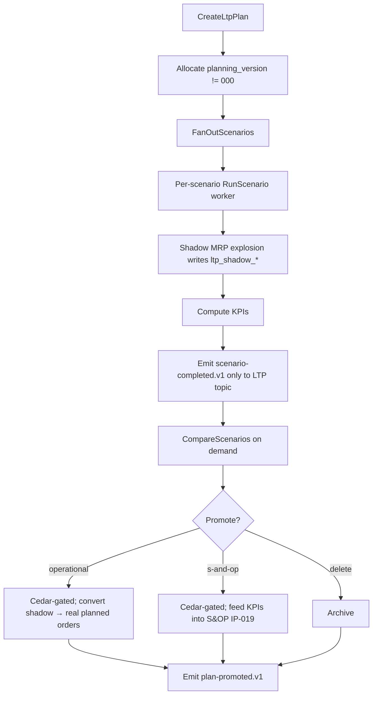

# IP-022: Long-term planning (LTP) vs short-term planning split — separate planning version + scenario fan-out

## A. Intent

Implements the **Long-Term Planning (LTP)** module of SAP `PP-MP-LTP` (transactions `MS01`–`MS04`, `MS31`, `MS70`) — a sandboxed simulation layer that runs MRP-like demand explosion on a **separate planning version** (SAP's "simulation version"; "version 000" is reserved for active production planning). LTP enables:

- **What-if scenario analysis** — try a hypothetical sales forecast, capacity expansion, or supplier-cutover without disturbing live operational plans.
- **Long-horizon capacity sizing** — 12–60 month horizon for vendor commitments, hire/fire labour planning.
- **Promotion impact modelling** — evaluate the supply-chain impact of marketing promotions before the S&OP cycle commits.
- **Multi-scenario fan-out** — N scenarios in parallel, each with its own demand + capacity + sourcing assumptions; comparison report at end.

Vendor parallels: Oracle Fusion Demand Management Cloud → Scenario Planning; Dynamics 365 SCM → Master planning Plans (multiple non-default plans); NetSuite Advanced Inventory → Demand Planning scenarios; Anaplan / o9 Solutions → multi-scenario sales-and-supply model.

### A.1 Why LTP must be strictly isolated

Live production-planning (version `000`) MUST NOT be affected by LTP simulation. Concretely:

1. LTP planning version is a **separate logical namespace** in all tables (planning_version column with check constraint that `000` is exclusive to operational use).
2. LTP outbox envelopes never publish to operational consumer topics — they go to `production-planning.ltp.scenario-result.v1` not the active MRP topic.
3. LTP capacity reservations are **shadow-reservations**: stored but never enforced against operational `WorkCenterCapacity` reservations.
4. LTP DDMRP buffer breaches do NOT create real planned orders.
5. Cedar policies for LTP are SEPARATE from operational policies — a planner with LTP-execute permit may LACK operational-MRP permit; the converse is also valid.

### A.2 Scenario fan-out

A single LTP request may spawn N scenarios in parallel:

```
scenario_set := {
  scenario_a: { demand_forecast: f1, capacity_envelope: c1, sourcing: s1 },
  scenario_b: { demand_forecast: f2, capacity_envelope: c1, sourcing: s1 },
  scenario_c: { demand_forecast: f1, capacity_envelope: c2, sourcing: s1 },
  ...
}
```

Workers run each scenario independently; comparison results aggregated at completion.

## B. Acceptance criteria

- **AC-1:** `CreateLtpPlanUseCase::execute(plan_id, horizon_months)` Cedar-gated on `production_planning::ltp::plan::create`; horizon 3..60 months.
- **AC-2:** All LTP tables include `planning_version TEXT NOT NULL` with check `planning_version != '000'`.
- **AC-3:** `RunLtpScenarioUseCase::execute(scenario)` Cedar-gated; runs MRP-like explosion on LTP planning version; emits to LTP topic only.
- **AC-4:** `FanOutLtpScenariosUseCase::execute(scenario_set)` spawns N parallel scenario runs via worker queue; returns aggregated handle.
- **AC-5:** `CompareLtpScenariosUseCase::execute(scenario_ids)` produces side-by-side comparison report with KPIs (total cost, capacity utilization, fill rate, on-time-delivery).
- **AC-6:** LTP results NEVER published to active MRP outbox; verified by topic-name allowlist at adapter.
- **AC-7:** `PromoteLtpScenarioUseCase::execute(scenario_id, promote_to=operational|s_and_op|delete)` — Cedar-gated; promotion converts LTP results to operational primitives.
- **AC-8:** Scenario TTL: default 90 days; auto-cleanup worker.
- **AC-9:** EU AI Act explainability per ADR-0257 — if scenario inputs include LLM-generated forecast, explainability record emitted on result.
- **AC-10:** Cross-tenant defence-in-depth.

## C. Verification

```bash
cargo test -p oya-production-planning-ltp-usecase -- create_plan_horizon_validation
cargo test -p oya-production-planning-ltp-usecase -- planning_version_isolation
cargo test -p oya-production-planning-ltp-usecase -- run_scenario_emits_to_ltp_topic
cargo test -p oya-production-planning-ltp-usecase -- run_scenario_does_not_emit_to_mrp_topic
cargo test -p oya-production-planning-ltp-usecase -- fan_out_n_scenarios_parallel
cargo test -p oya-production-planning-ltp-usecase -- compare_scenarios_kpis
cargo test -p oya-production-planning-ltp-usecase -- promote_to_operational_cedar_gated
cargo test -p oya-production-planning-ltp-usecase -- promote_to_s_and_op_handoff
cargo test -p oya-production-planning-ltp-usecase -- ai_forecast_explainability_record
cargo test -p oya-production-planning-ltp-usecase -- scenario_ttl_cleanup_worker
cargo test -p oya-production-planning-ltp-usecase -- cross_tenant_load_rejected
```

## D. Detailed mechanics

### D-1. Data model

```sql
CREATE TABLE production_planning.ltp_plan (
    tenant_id         TEXT NOT NULL,
    plan_id           TEXT NOT NULL,
    planning_version  TEXT NOT NULL CHECK (planning_version != '000'),
    horizon_months    INTEGER NOT NULL CHECK (horizon_months BETWEEN 3 AND 60),
    description       TEXT,
    authored_by       TEXT NOT NULL,
    state             TEXT NOT NULL CHECK (state IN ('draft','running','completed','promoted','archived','expired')),
    expires_at        TIMESTAMPTZ NOT NULL,
    hlc               TEXT NOT NULL,
    decision_id       UUID NOT NULL,
    PRIMARY KEY (tenant_id, plan_id)
) PARTITION BY HASH (tenant_id);

CREATE TABLE production_planning.ltp_scenario (
    tenant_id          TEXT NOT NULL,
    scenario_id        UUID NOT NULL,
    plan_id            TEXT NOT NULL,
    demand_forecast_version  TEXT NOT NULL,
    capacity_envelope_version TEXT NOT NULL,
    sourcing_version    TEXT NOT NULL,
    ai_assisted         BOOLEAN NOT NULL DEFAULT FALSE,
    explainability_record_id UUID,
    state               TEXT NOT NULL CHECK (state IN ('queued','running','completed','failed','promoted')),
    kpi_total_cost      NUMERIC(18,2),
    kpi_capacity_util   NUMERIC(5,4),
    kpi_fill_rate       NUMERIC(5,4),
    kpi_on_time_delivery NUMERIC(5,4),
    completed_at        TIMESTAMPTZ,
    hlc                 TEXT NOT NULL,
    decision_id         UUID NOT NULL,
    PRIMARY KEY (tenant_id, scenario_id)
) PARTITION BY HASH (tenant_id);

-- shadow tables for LTP results (no operational impact)
CREATE TABLE production_planning.ltp_shadow_planned_order (
    tenant_id        TEXT NOT NULL,
    scenario_id      UUID NOT NULL,
    shadow_order_id  TEXT NOT NULL,
    material_id      TEXT NOT NULL,
    plant_code       TEXT NOT NULL,
    qty              NUMERIC(18,4) NOT NULL,
    start_date       DATE NOT NULL,
    finish_date      DATE NOT NULL,
    pegged_demand_keys JSONB NOT NULL DEFAULT '[]',
    PRIMARY KEY (tenant_id, scenario_id, shadow_order_id)
) PARTITION BY HASH (tenant_id);
```

### D-2. Rust types

```rust
#[derive(Debug, Clone)]
pub struct LtpPlan {
    pub tenant_id: TenantId, pub plan_id: PlanId,
    pub planning_version: PlanningVersion,   // never "000"
    pub horizon_months: u32, pub state: LtpPlanState,
    pub expires_at: DateTime<Utc>, pub hlc: Hlc, pub decision_id: DecisionId,
}

#[derive(Debug, Clone)]
pub struct LtpScenario {
    pub tenant_id: TenantId, pub scenario_id: Uuid,
    pub plan_id: PlanId, pub demand_fcst: ForecastRef,
    pub capacity_env: CapacityEnvelopeRef, pub sourcing: SourcingRef,
    pub ai_assisted: bool, pub explainability_record_id: Option<Uuid>,
    pub state: ScenarioState, pub kpis: LtpKpis,
    pub hlc: Hlc, pub decision_id: DecisionId,
}

#[derive(Debug, Clone, Default)]
pub struct LtpKpis {
    pub total_cost: Decimal, pub capacity_util: Decimal,
    pub fill_rate: Decimal, pub on_time_delivery: Decimal,
}
```

### D-3. Scenario fan-out

```rust
pub async fn fan_out(&self, set: ScenarioSet) -> Result<FanOutHandle, UseCaseError> {
    let decision = self.cedar.evaluate(cedar_req_fanout(&set)).await?;
    if !decision.is_permit() { return Err(UseCaseError::PermissionDenied { reason: decision.reasons() }); }
    let mut handles = Vec::new();
    for spec in set.scenarios {
        let task = tokio::spawn({
            let svc = self.clone();
            async move { svc.run_scenario(spec).await }
        });
        handles.push(task);
    }
    let fanout_id = Uuid::new_v4();
    self.repo.record_fanout(&set.tenant_id, &fanout_id, &set, &decision).await?;
    Ok(FanOutHandle { fanout_id, count: handles.len(), join_handles: handles })
}
```

### D-4. Run-scenario internals (LTP-MRP explosion)

```rust
pub async fn run_scenario(&self, spec: ScenarioSpec) -> Result<ScenarioResult, UseCaseError> {
    // Use the same MRP explosion algorithm as IP-002/IP-008 BUT writes to ltp_shadow_* tables only
    let tx = self.repo.begin_tx().await?;
    let demand = self.demand_loader.load_forecast(&spec.demand_forecast).await?;
    let capacity = self.capacity_loader.load_envelope(&spec.capacity_envelope).await?;
    let sourcing = self.sourcing_loader.load_policy(&spec.sourcing).await?;

    let explosion = mrp_explode_lt(&demand, &capacity, &sourcing, ExplodeMode::LtpShadow).await?;

    let mut kpis = LtpKpis::default();
    for shadow_order in explosion.shadow_orders {
        self.repo.save_shadow_planned_order(&tx, &shadow_order).await?;
        kpis.total_cost += shadow_order.cost_estimate;
    }
    kpis.capacity_util = compute_capacity_util(&explosion, &capacity);
    kpis.fill_rate = compute_fill_rate(&demand, &explosion);
    kpis.on_time_delivery = compute_otd(&demand, &explosion);

    self.repo.save_scenario_result(&tx, &spec.scenario_id, &kpis).await?;
    self.outbox.append(&tx, &ltp_scenario_completed_event(&spec, &kpis)).await?;
    if spec.ai_assisted {
        self.outbox.append(&tx, &ai_explainability_event(&spec, &kpis)).await?;
    }
    tx.commit().await?;
    Ok(ScenarioResult { scenario_id: spec.scenario_id, kpis })
}
```

### D-5. Topic allowlist (adapter)

```rust
pub fn assert_ltp_topic_allowlist(topic: &str) -> Result<(), AdapterError> {
    const LTP_ALLOWED: &[&str] = &[
        "production-planning.ltp.scenario-queued.v1",
        "production-planning.ltp.scenario-running.v1",
        "production-planning.ltp.scenario-completed.v1",
        "production-planning.ltp.scenario-failed.v1",
        "production-planning.ltp.plan-promoted.v1",
        "production-planning.ltp.ai-explainability-record.v1",
        "production-planning.ltp.fanout-recorded.v1",
    ];
    if !LTP_ALLOWED.contains(&topic) {
        return Err(AdapterError::LtpTopicNotAllowed { topic: topic.to_string() });
    }
    Ok(())
}
```

### D-6. Promote use-case

```rust
pub enum PromoteTarget { Operational, SAndOp, Delete }

pub async fn promote(&self, input: PromoteInput) -> Result<PromoteOutput, UseCaseError> {
    let decision = self.cedar.evaluate(cedar_req_promote(&input)).await?;
    if !decision.is_permit() { return Err(UseCaseError::PermissionDenied { reason: decision.reasons() }); }

    let tx = self.repo.begin_tx().await?;
    let scenario = self.repo.load_scenario(&tx, &input.tenant_id, &input.scenario_id).await?
        .ok_or(UseCaseError::NotFound)?;
    if scenario.state != ScenarioState::Completed { return Err(UseCaseError::IllegalStateTransition { from: scenario.state, to: ScenarioState::Promoted }); }
    match input.target {
        PromoteTarget::Operational => {
            // Convert shadow planned orders to real planned orders via MRP-run usecase
            let shadows = self.repo.list_shadow_orders(&tx, &input.tenant_id, &scenario.scenario_id).await?;
            for s in shadows {
                self.mrp_run.create_planned_order_from_shadow(&tx, s, &decision).await?;
            }
        }
        PromoteTarget::SAndOp => {
            // Feed KPIs into S&OP cycle (IP-019)
            self.outbox.append(&tx, &ltp_promoted_to_sop_event(&scenario, &decision)).await?;
        }
        PromoteTarget::Delete => { /* state -> archived */ }
    }
    self.repo.transition_scenario(&tx, &input.tenant_id, &input.scenario_id, ScenarioState::Promoted).await?;
    self.outbox.append(&tx, &ltp_plan_promoted_event(&scenario, input.target, &decision)).await?;
    self.audit.emit(&tx, AuditEntry::promote(&scenario, input.target, &decision)).await?;
    tx.commit().await?;
    Ok(PromoteOutput { decision_id: decision.decision_id, target: input.target })
}
```

### D-7. Cedar context (promote-to-operational is the most sensitive)

```jsonc
{
  "principal": "oyatie::tenant::acme::user::production-director-1",
  "action":    "production_planning::ltp::scenario::promote_to_operational",
  "resource":  "production_planning::ltp::scenario::{uuid}",
  "context": {
    "tenant_id": "acme", "planning_version": "LTP-2026Q3-A",
    "scenario_kpis_total_cost": 12345678.00, "scenario_kpis_fill_rate": 0.93,
    "data_class": "operational",
    "policy_bundle_version": "2026.05.20-r3",
    "residency_pack": "global+kr",
    "byok_mode": "platform_default"
  }
}
```

### D-8. AsyncAPI envelopes (LTP-only allowlist)

| Channel | Trigger | Consumers |
|---|---|---|
| `production-planning.ltp.plan-created.v1` | create plan | `dashboards`, `audit` |
| `production-planning.ltp.scenario-queued.v1` | scenario queued | `worker`, `dashboards` |
| `production-planning.ltp.scenario-running.v1` | scenario start | `dashboards` |
| `production-planning.ltp.scenario-completed.v1` | scenario complete | `dashboards`, `comparison-worker` |
| `production-planning.ltp.scenario-failed.v1` | scenario error | `alerting`, `dashboards` |
| `production-planning.ltp.plan-promoted.v1` | promote | `mrp-run` (if operational) / `s-and-op` (if SOP) |
| `production-planning.ltp.ai-explainability-record.v1` | AI-assisted scenario | `compliance-substrate` |
| `production-planning.ltp.fanout-recorded.v1` | fan-out | `dashboards` |

### D-9. Workflow with decision branches



### D-10. SLO targets

| Operation | Scale | p50 | p95 | p99 | Rationale |
|---|---|---|---|---|---|
| `CreateLtpPlan` | — | 18 ms | 42 ms | 85 ms | Cedar + DB write. |
| `RunScenario` (10k materials) | medium | 4 s | 10 s | 22 s | Shadow MRP explosion. |
| `RunScenario` (100k materials) | large | 35 s | 80 s | 180 s | Sized for monthly LTP run. |
| `FanOutScenarios` (10 parallel) | — | 1 s | 2 s | 5 s | Queue dispatch overhead. |
| `CompareScenarios` (10 scenarios) | — | 0.5 s | 1.2 s | 2.5 s | KPI join + report build. |
| `PromoteToOperational` (5k shadow→real) | medium | 8 s | 18 s | 35 s | Per-order MRP-run hand-off. |

### D-11. Audit-event registry

| Event class | Severity | Emitter |
|---|---|---|
| `EVT-PRODUCTION_PLANNING-LTP-PLAN_CREATED` | informational | usecase |
| `EVT-PRODUCTION_PLANNING-LTP-SCENARIO_RAN` | informational | worker |
| `EVT-PRODUCTION_PLANNING-LTP-SCENARIO_FAILED` | warning | worker |
| `EVT-PRODUCTION_PLANNING-LTP-PLAN_PROMOTED_OPERATIONAL` | informational | usecase |
| `EVT-PRODUCTION_PLANNING-LTP-PLAN_PROMOTED_SOP` | informational | usecase |
| `EVT-PRODUCTION_PLANNING-LTP-PERMISSION_DENIED` | security | usecase |
| `EVT-PRODUCTION_PLANNING-LTP-AI_EXPLAINABILITY_EMITTED` | informational | usecase |

### D-12. Failure modes & recovery

1. **`PlanningVersionCollision`** — caller attempts to use `000` as planning_version. DB check fails; usecase rejects. Hard error.
2. **`ScenarioWorkerCrash`** — scenario state stuck in `running`. Auto-watchdog at 6h flags as `failed`; planner re-runs. Runbook `runbooks/ltp-scenario-worker-crash.md`.
3. **`PromotionConflictWithLive`** — promoting LTP to operational while live MRP run in progress. Coordinator serialises; LTP promotion waits. Runbook `runbooks/ltp-promotion-conflict.md`.
4. **`TopicAllowlistViolation`** — adapter would emit non-LTP topic from LTP path. AdapterError; tx rolled back; critical security alert.
5. **`ScenarioExpired`** — TTL elapsed; auto-archived. Recovery: re-create scenario from saved spec.
6. **`AiExplainabilityEmissionFailed`** — Annex III record fails; scenario completion tx rolled back; runbook `runbooks/ltp-ai-explainability.md`.

### D-13. Migration notes

Source vendor surface: SAP `MS01-MS04`, `MS31`, `MS70` LTP transactions; table `PLAF` (planned orders) keyed by `PLWRK`/`MATNR`/`PLNUM` AND `PLSCN` (planning version). LTP tables shadow PP-MRP tables but partitioned by planning version. Migration: replay historical LTP runs into shadow tables for audit history; live MRP version `000` untouched.

### D-14. Ontology projection

LTP scenarios project under a separate `ontology.ltp` namespace so BI queries can keep operational and simulation graphs distinct.

### D-15. Cross-µservice handoffs

| Direction | Counterparty | Channel |
|---|---|---|
| inbound  | `sales-forecast`        | gRPC `sales_forecast.v1.LoadVersion` |
| inbound  | `procurement` (sourcing policies) | gRPC |
| inbound  | `ai-substrate`          | gRPC `ai_substrate.v1.SuggestForecast` (Annex III explainability) |
| outbound | `mrp-run` (on promote-operational) | gRPC `mrp_run.v1.PromoteShadowOrders` |
| outbound | `s-and-op` (on promote-SOP) | AsyncAPI `ltp.plan-promoted.v1` |
| outbound | `dashboards`            | AsyncAPI `ltp.scenario-completed.v1` |
| outbound | `compliance-substrate`  | AsyncAPI `ltp.ai-explainability-record.v1` |

## E. Failure-mode summary

See D-12.

## F. Migration / rollback

Feature flag `production_planning_ltp_v1`. Disabling halts new scenario runs; completed scenarios remain inspectable. Operational MRP unaffected (strict isolation by planning_version).

## G. References

- ADR-0105, ADR-0244, ADR-0257 (EU AI Act), ADR-0263, ADR-0294, ADR-0297, ADR-0315.
- SAP S/4HANA `PP-MP-LTP` (Long-Term Planning) — transactions `MS01`-`MS04`, `MS31`, `MS70`; planning version primer.
- Benchmarks: SAP PP-MP-LTP | Oracle Demand Management Cloud Scenarios | Dynamics 365 SCM master planning Plans | Anaplan multi-scenario model | o9 Solutions multi-scenario planning.

## H. Out of scope

- Operational MRP (IP-002/IP-008), DDMRP (IP-018), S&OP (IP-019), capacity leveling (IP-021), MES (IP-024).

— end IP-022 —
