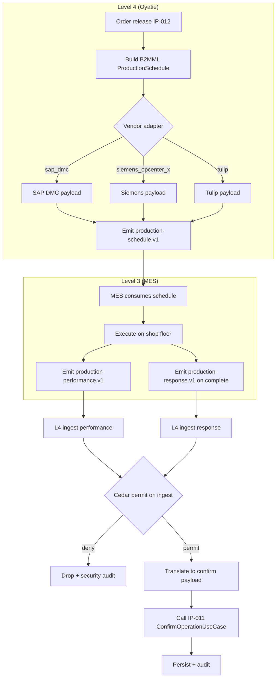

# IP-024: MES (Manufacturing Execution System) handshake — bidirectional event flow with named ISA-95 levels

## A. Intent

Implements the **bidirectional handshake** between Oyatie production-planning (ISA-95 Level 4 — *Business Logistics Planning & Scheduling*) and Manufacturing Execution Systems (ISA-95 Level 3 — *Manufacturing Operations Management*). The handshake follows the **ISA-95 / IEC 62264** standard and uses **B2MML (Business To Manufacturing Markup Language)** message types from the MESA (Manufacturing Enterprise Solutions Association) consortium for cross-vendor interoperability.

ISA-95 reference levels:

```
Level 4: Business Logistics Planning & Scheduling   <-- this µservice (production-planning) lives here
                              ↕  (this IP)
Level 3: Manufacturing Operations Management         <-- target MES counterparty
Level 2: Supervisory Control (SCADA)
Level 1: Sensing / Actuation (PLC)
Level 0: Physical Process
```

Vendor parallels of the Level-3 MES counterparty: SAP DMC (Digital Manufacturing Cloud), SAP ME (Manufacturing Execution); Oracle MES Cloud; Siemens Opcenter Execution; Dassault DELMIA Apriso; Rockwell PlantPAx + FactoryTalk ProductionCentre; AVEVA MES; Critical Manufacturing CMF; Tulip frontline ops platform.

### A.1 Why bidirectional handshake is non-trivial

1. **Two-way envelope translation** — Level 4 emits B2MML `ProductionSchedule`/`ProductionDispatchList`; Level 3 emits `ProductionPerformance`/`ProductionResponse`. Both directions must map to/from internal Rust domain types without data loss.
2. **Async-by-default** — MES counterparties run their own cadence; no synchronous request/response. All flow is AsyncAPI envelopes over Kafka with idempotency on both sides.
3. **Time-synchronization** — ISA-95 requires both sides agree on wall-clock per ISA-95 Part 5. Oyatie carries HLC + UTC timestamp; MES counterparts that lack HLC awareness fall back to UTC with reconciliation drift ≤ ±2s.
4. **State-machine consistency** — Oyatie's production-order state machine (IP-011 D-2) MUST stay consistent with MES execution state. Drift detection runs every 5min; reconcile job fires on drift > 0.
5. **Tenant pin + ISA-95 hierarchy mapping** — Oyatie's `(tenant, plant, work_center, work_unit)` maps to ISA-95's `(EnterpriseRef, SiteRef, AreaRef, WorkUnitRef)`; mis-mapping = data leak between tenants.
6. **Vendor adapter abstraction** — each MES vendor has dialect quirks; per-vendor adapter overlays handle dialect translation while the core port stays vendor-neutral.

## B. Acceptance criteria

- **AC-1:** `EmitProductionScheduleToMesUseCase::execute(order)` emits B2MML-compatible `production-planning.mes.production-schedule.v1` envelope on release.
- **AC-2:** `EmitProductionDispatchListUseCase::execute(window)` emits dispatch list per (work_center, time_window).
- **AC-3:** `IngestProductionPerformanceUseCase::handle(event)` consumes Level-3 `ProductionPerformance` events; updates `production-order` confirmations.
- **AC-4:** `IngestProductionResponseUseCase::handle(event)` consumes Level-3 `ProductionResponse` events; closes loop on completion/cancel.
- **AC-5:** State-machine drift detector: Oyatie order state vs MES execution state polled every 5min; drift triggers `mes-state-drift.v1` event + Cedar-gated reconcile UC.
- **AC-6:** ISA-95 hierarchy strictly mapped: `EnterpriseRef = tenant_id`, `SiteRef = plant_code`, `AreaRef = production_area`, `WorkUnitRef = work_center`.
- **AC-7:** Tenant pin defence-in-depth at envelope translation (in AND out); cross-tenant rejection logged + security audit.
- **AC-8:** Per-vendor adapter overlay supports: `sap-dmc`, `sap-me`, `siemens-opcenter-x`, `delmia-apriso`, `aveva-mes`, `critical-manufacturing-cmf`, `tulip`, `generic-b2mml`.
- **AC-9:** Idempotency: outgoing event_id stable on retry; incoming event_id deduped at consumer.
- **AC-10:** Audit emission per ADR-0263.

## C. Verification

```bash
cargo test -p oya-production-planning-mes-usecase -- emit_schedule_b2mml_envelope_schema
cargo test -p oya-production-planning-mes-usecase -- emit_dispatch_list_per_wc
cargo test -p oya-production-planning-mes-usecase -- ingest_production_performance_updates_confirms
cargo test -p oya-production-planning-mes-usecase -- ingest_production_response_closes_order
cargo test -p oya-production-planning-mes-usecase -- state_drift_detector_emits_event
cargo test -p oya-production-planning-mes-usecase -- isa_95_hierarchy_mapping_strict
cargo test -p oya-production-planning-mes-usecase -- cross_tenant_envelope_rejected
cargo test -p oya-production-planning-mes-usecase -- per_vendor_adapter_sap_dmc
cargo test -p oya-production-planning-mes-usecase -- per_vendor_adapter_siemens_opcenter_x
cargo test -p oya-production-planning-mes-usecase -- per_vendor_adapter_tulip
cargo test -p oya-production-planning-mes-usecase -- idempotent_outgoing_event_id
cargo test -p oya-production-planning-mes-usecase -- idempotent_incoming_dedupe
cargo test -p oya-production-planning-mes-usecase -- reconcile_after_drift_cedar_gated
```

## D. Detailed mechanics

### D-1. Data model

```sql
CREATE TABLE production_planning.mes_handshake (
    tenant_id        TEXT NOT NULL,
    order_id         TEXT NOT NULL,
    vendor_adapter   TEXT NOT NULL CHECK (vendor_adapter IN
        ('sap_dmc','sap_me','siemens_opcenter_x','delmia_apriso','aveva_mes','critical_manufacturing_cmf','tulip','generic_b2mml')),
    isa95_enterprise_ref TEXT NOT NULL,
    isa95_site_ref       TEXT NOT NULL,
    isa95_area_ref       TEXT NOT NULL,
    isa95_work_unit_ref  TEXT NOT NULL,
    outgoing_event_id    UUID,
    last_outgoing_state  TEXT,
    last_incoming_state  TEXT,
    last_drift_detected  TIMESTAMPTZ,
    hlc                  TEXT NOT NULL,
    decision_id          UUID NOT NULL,
    PRIMARY KEY (tenant_id, order_id)
) PARTITION BY HASH (tenant_id);

CREATE TABLE production_planning.mes_dedup (
    tenant_id      TEXT NOT NULL,
    event_id       UUID NOT NULL,
    received_at    TIMESTAMPTZ NOT NULL DEFAULT now(),
    PRIMARY KEY (tenant_id, event_id)
) PARTITION BY RANGE (received_at);
```

### D-2. Rust types

```rust
#[derive(Debug, Clone)]
pub struct Isa95Ref {
    pub enterprise: EnterpriseRef,    // == tenant_id
    pub site: SiteRef,                // == plant_code
    pub area: AreaRef,                // == production_area
    pub work_unit: WorkUnitRef,       // == work_center
}

#[derive(Debug, Clone)]
pub enum VendorAdapter {
    SapDmc, SapMe, SiemensOpcenterX, DelmiaApriso,
    AvevaMes, CriticalManufacturingCmf, Tulip, GenericB2mml,
}

#[derive(Debug, Clone)]
pub struct ProductionScheduleEnvelope {
    pub event_id: Uuid, pub tenant_id: TenantId, pub order_id: OrderId,
    pub isa95: Isa95Ref, pub vendor: VendorAdapter,
    pub schedule_payload: B2mmlProductionSchedule,
    pub hlc: Hlc, pub utc_ts: DateTime<Utc>, pub decision_id: DecisionId,
}

#[derive(Debug, Clone)]
pub struct ProductionPerformanceEnvelope {
    pub event_id: Uuid, pub tenant_id: TenantId, pub order_id: OrderId,
    pub isa95: Isa95Ref, pub vendor: VendorAdapter,
    pub performance_payload: B2mmlProductionPerformance,
    pub mes_hlc_or_utc: HlcOrUtc, pub mes_utc_ts: DateTime<Utc>,
}
```

### D-3. B2MML mapping (schedule emission)

```rust
pub fn to_b2mml_production_schedule(o: &ProductionOrder, mes: &MesHandshake) -> B2mmlProductionSchedule {
    B2mmlProductionSchedule {
        id: format!("OYA-{}-{}", mes.tenant_id, o.order_id),
        published_date: o.released_at().to_rfc3339(),
        production_request: vec![
            ProductionRequest {
                id: o.order_id.to_string(),
                hierarchy_scope: HierarchyScope {
                    equipment_id: mes.isa95.work_unit.clone(),
                    equipment_element_level: ElementLevel::WorkUnit,
                },
                start_time: o.planned_start().to_rfc3339(),
                end_time: o.planned_finish().to_rfc3339(),
                material_requirement: o.bom_components_for_mes().iter().map(|c| MaterialRequirement {
                    material_definition_id: c.material_id.to_string(),
                    quantity: c.gross_qty,
                    unit_of_measure: c.unit.to_string(),
                    material_use: MaterialUse::Consumed,
                }).collect(),
                segment_requirement: o.routing_steps_for_mes().iter().map(|s| SegmentRequirement {
                    operation_id: s.operation_no.to_string(),
                    equipment_requirement: EquipmentRequirement {
                        equipment_class_id: s.work_center_id.to_string(),
                        quantity: dec!(1),
                    },
                }).collect(),
            }
        ],
    }
}
```

### D-4. Performance ingestion (Level-3 → Level-4)

```rust
pub async fn handle_performance(&self, ev: ProductionPerformanceEnvelope) -> Result<(), UseCaseError> {
    // Tenant pin + dedupe
    if ev.tenant_id != ev.isa95.enterprise.clone().into() {
        return Err(UseCaseError::CrossTenant);
    }
    let tx = self.repo.begin_tx().await?;
    if self.repo.seen_event(&tx, &ev.tenant_id, &ev.event_id).await? {
        tx.commit().await?;
        return Ok(());  // idempotent
    }
    self.repo.mark_event_seen(&tx, &ev.tenant_id, &ev.event_id).await?;

    // Cedar gate (defence-in-depth — Cedar policies for ingested MES events validate origin)
    let decision = self.cedar.evaluate(cedar_req_mes_ingest(&ev)).await?;
    if !decision.is_permit() {
        return Err(UseCaseError::PermissionDenied { reason: decision.reasons() });
    }

    // Translate B2MML performance to internal confirm payload
    let confirms = self.vendor_adapter(ev.vendor).translate_performance_to_confirms(&ev.performance_payload)?;
    for confirm in confirms {
        self.confirm_uc.confirm_operation(confirm).await?;  // re-enters IP-011 confirm path
    }

    // HLC reconcile
    if let HlcOrUtc::Utc(utc) = ev.mes_hlc_or_utc {
        let drift = (Utc::now() - utc).num_seconds().abs();
        if drift > 2 { self.audit.emit(&tx, AuditEntry::mes_clock_drift(&ev, drift)).await?; }
    }
    tx.commit().await?;
    Ok(())
}
```

### D-5. Drift detector (cron, 5min)

```rust
pub async fn detect_state_drift(&self) -> Result<DriftReport, UseCaseError> {
    let mut report = DriftReport::default();
    let active_orders = self.repo.active_mes_handshakes().await?;
    for hs in active_orders {
        let oya_state = self.order_repo.state(&hs.tenant_id, &hs.order_id).await?;
        let mes_state = self.mes_client(hs.vendor).query_state(&hs).await?;
        if !is_consistent(oya_state, mes_state) {
            report.drifts.push(StateDrift { handshake: hs.clone(), oya_state, mes_state });
            self.outbox.append_outside_tx(&mes_state_drift_event(&hs, oya_state, mes_state)).await?;
        }
    }
    Ok(report)
}

fn is_consistent(oya: OrderState, mes: MesExecutionState) -> bool {
    use OrderState::*; use MesExecutionState::*;
    matches!((oya, mes),
        (Released, Dispatched) | (Released, Started) |
        (InProgress, Started) | (InProgress, Producing) |
        (PartiallyConfirmed, PartiallyComplete) |
        (Confirmed, Complete) |
        (Teco, Closed) | (Closed, Closed) |
        (Cancelled, Cancelled))
}
```

### D-6. Per-vendor adapter trait

```rust
#[async_trait]
pub trait MesVendorAdapter: Send + Sync {
    fn translate_performance_to_confirms(&self, p: &B2mmlProductionPerformance) -> Result<Vec<ConfirmPayload>, AdapterError>;
    fn translate_response_to_completion(&self, r: &B2mmlProductionResponse) -> Result<CompletionEvent, AdapterError>;
    fn translate_schedule_to_vendor(&self, s: &B2mmlProductionSchedule) -> Result<VendorPayload, AdapterError>;
    async fn query_state(&self, hs: &MesHandshake) -> Result<MesExecutionState, AdapterError>;
}

pub fn vendor_adapter(v: VendorAdapter) -> Arc<dyn MesVendorAdapter> {
    match v {
        VendorAdapter::SapDmc => Arc::new(SapDmcAdapter::new()),
        VendorAdapter::SapMe => Arc::new(SapMeAdapter::new()),
        VendorAdapter::SiemensOpcenterX => Arc::new(SiemensOpcenterXAdapter::new()),
        VendorAdapter::DelmiaApriso => Arc::new(DelmiaAprisoAdapter::new()),
        VendorAdapter::AvevaMes => Arc::new(AvevaMesAdapter::new()),
        VendorAdapter::CriticalManufacturingCmf => Arc::new(CriticalManufacturingAdapter::new()),
        VendorAdapter::Tulip => Arc::new(TulipAdapter::new()),
        VendorAdapter::GenericB2mml => Arc::new(GenericB2mmlAdapter::new()),
    }
}
```

### D-7. Cedar context (incoming envelope validation)

```jsonc
{
  "principal": "oyatie::tenant::acme::mes::sap-dmc",
  "action":    "production_planning::mes::ingest_performance",
  "resource":  "production_planning::production_order::PO-FG-0001-9001",
  "context": {
    "tenant_id": "acme", "isa95_enterprise": "acme",
    "vendor_adapter": "sap_dmc", "event_id": "{uuid}",
    "data_class": "operational",
    "policy_bundle_version": "2026.05.20-r3",
    "residency_pack": "global+kr",
    "byok_mode": "platform_default"
  }
}
```

### D-8. AsyncAPI envelopes

| Direction | Channel | Trigger | Notes |
|---|---|---|---|
| L4→L3 | `production-planning.mes.production-schedule.v1` | order release (IP-012) | B2MML ProductionSchedule |
| L4→L3 | `production-planning.mes.production-dispatch-list.v1` | shift change cron | B2MML DispatchList |
| L4→L3 | `production-planning.mes.order-cancelled.v1` | order cancel (IP-011) | B2MML OperationsRequest cancel |
| L3→L4 | `mes.production-performance.v1` | MES confirms | B2MML ProductionPerformance |
| L3→L4 | `mes.production-response.v1` | MES completes | B2MML ProductionResponse |
| L3→L4 | `mes.equipment-state.v1` | WC down/up | B2MML EquipmentState |
| L4→L3 | `production-planning.mes.state-drift-detected.v1` | drift detector | Internal + L3-notification |
| L4→L3 | `production-planning.mes.reconcile-request.v1` | reconcile UC | Cedar-gated |

### D-9. Workflow with decision branches



### D-10. SLO targets

| Operation | p50 | p95 | p99 | Rationale |
|---|---|---|---|---|
| `EmitProductionSchedule` (per order) | 22 ms | 50 ms | 100 ms | B2MML serialize + envelope + outbox. |
| `EmitProductionDispatchList` (per WC) | 35 ms | 80 ms | 180 ms | Aggregate 50-200 orders. |
| `IngestProductionPerformance` (per confirm) | 18 ms | 40 ms | 85 ms | Dedupe + Cedar + translate + IP-011 confirm. |
| `DetectStateDrift` (1000 orders) | 1.5 s | 3 s | 6 s | Per-order MES query (parallelized). |

### D-11. Audit-event registry

| Event class | Severity | Emitter |
|---|---|---|
| `EVT-PRODUCTION_PLANNING-MES-SCHEDULE_EMITTED` | informational | usecase |
| `EVT-PRODUCTION_PLANNING-MES-PERFORMANCE_INGESTED` | informational | usecase |
| `EVT-PRODUCTION_PLANNING-MES-RESPONSE_INGESTED` | informational | usecase |
| `EVT-PRODUCTION_PLANNING-MES-STATE_DRIFT_DETECTED` | warning | usecase |
| `EVT-PRODUCTION_PLANNING-MES-RECONCILE_TRIGGERED` | informational | usecase |
| `EVT-PRODUCTION_PLANNING-MES-CLOCK_DRIFT_EXCESSIVE` | warning | usecase |
| `EVT-PRODUCTION_PLANNING-MES-CROSS_TENANT_REJECTED` | security | usecase |
| `EVT-PRODUCTION_PLANNING-MES-PERMISSION_DENIED` | security | usecase |
| `EVT-PRODUCTION_PLANNING-MES-VENDOR_ADAPTER_ERROR` | warning | usecase |

### D-12. Failure modes & recovery

1. **`VendorAdapterTranslationError`** — incoming envelope malformed; routed to DLQ; alert on rate > 5/min. Runbook `runbooks/mes-adapter-error.md`.
2. **`StateDriftDetected`** — Oyatie vs MES state diverged. Reconcile UC fires; if drift persists 2 cycles, planner page. Runbook `runbooks/mes-state-drift.md`.
3. **`MesClockDriftExcessive`** — > 2s difference. Reconciliation drift logged; if > 30s, all subsequent MES events flagged `low_confidence`. Runbook `runbooks/mes-clock-drift.md`.
4. **`CrossTenantEnvelope`** — envelope's `enterprise_ref` ≠ `tenant_id`. Dropped + security audit. Runbook `runbooks/cross-tenant-leak-suspected.md`.
5. **`DuplicateIngestion`** — same `event_id` arrives twice. Idempotency stops second; no double-confirm. Logged at INFO.
6. **`MesUnavailable`** — outgoing emit OK (Kafka queues); incoming gap. Drift detector eventually fires. Runbook `runbooks/mes-unavailable.md`.
7. **`MesScheduleRejected`** — vendor rejects schedule (e.g., capacity conflict on their side). Reconcile UC alerts; planner manually adjusts.

### D-13. Migration notes

Source vendor surface:

- SAP DMC: B2MML over SAP CPI (Cloud Platform Integration).
- SAP ME: Direct B2MML XML over MII (Manufacturing Integration & Intelligence).
- Siemens Opcenter Execution: OAGIS BODs (Business Object Documents) + B2MML.
- DELMIA Apriso: native MOM (Manufacturing Operations Management) XML.
- AVEVA MES: B2MML over OPC UA + ISA-95.
- Critical Manufacturing CMF: REST + AMQP + B2MML.
- Tulip: REST webhooks + JSON.

Each adapter is its own crate (`crates/oya-mes-adapter-{vendor}-app`) so vendor specifics don't pollute the core.

### D-14. Ontology projection

```rust
pub fn project_mes_handshake(hs: &MesHandshake) -> OntologyDelta {
    OntologyDelta::new()
        .upsert_node(NodeRef::mes_handshake(hs.tenant_id.clone(), hs.order_id.clone()))
        .upsert_edge(Edge::isa95_hierarchy(hs.isa95.clone()))
        .with_attrs([("vendor_adapter", hs.vendor_adapter.to_string())])
        .with_hlc(hs.hlc.clone())
}
```

### D-15. Cross-µservice handoffs

| Direction | Counterparty | Surface |
|---|---|---|
| outbound | MES vendor (per adapter) | AsyncAPI per channel listed in D-8 |
| inbound  | MES vendor | AsyncAPI per channel listed in D-8 |
| outbound | `production-order` (IP-011) | direct call into ConfirmOperationUseCase |
| outbound | `quality-management` | AsyncAPI on equipment-down event |
| outbound | `plant-maintenance` | AsyncAPI on equipment-state event |
| outbound | `dashboards` | AsyncAPI on drift event |

## E. Failure-mode summary

See D-12.

## F. Migration / rollback

Per-vendor feature flags: `pp_mes_sap_dmc_v1`, `pp_mes_siemens_opcenter_x_v1`, etc. Disabling a vendor adapter pauses its handshakes; other adapters unaffected.

## G. References

- ANSI/ISA-95 / IEC 62264 — Enterprise-Control System Integration (Parts 1-5).
- MESA International — B2MML message specifications.
- ADR-0105, ADR-0244, ADR-0263, ADR-0294, ADR-0297, ADR-0314, ADR-0315.
- SAP DMC, SAP ME, Siemens Opcenter Execution, DELMIA Apriso, AVEVA MES, Critical Manufacturing CMF, Tulip product documentation.
- Benchmarks: SAP DMC | SAP ME | Siemens Opcenter Execution | DELMIA Apriso | AVEVA MES | Critical Manufacturing CMF | Tulip frontline ops.

## H. Out of scope

- Order CRUD (IP-011), shop-floor-release (IP-012), capacity leveling (IP-021), DDMRP (IP-018), S&OP (IP-019), production-line balancing (IP-025).

— end IP-024 —
