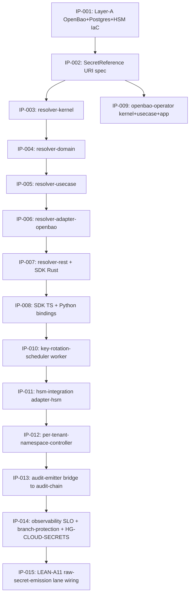

# PHASE-01 — OpenBao Secret-Manager Substrate + SecretReference Contract

## Intent

Stand up the OpenBao operator, the SecretReference resolver SDK, per-tenant namespace controller, key-rotation scheduler, HSM integration, and audit emitter for the `cloud-secrets` µservice. Mechanically enforce the durable user directive (2026-05-12): **no raw secrets in repo/chat/checkpoints; every secret consumed via `${openbao:secret/<path>}` reference through the SDK.**

## Scope

| In-scope | Out-of-scope |
|---|---|
| OpenBao 2.x LTS Helm chart + Kubernetes operator | OpenBao authn backend customisation (use OIDC + Kubernetes ServiceAccount only) |
| Postgres-HA (Patroni) backend for OpenBao | Postgres app-data — owned by `cloud-iac` per-product Patroni operator |
| OCI Cloud-HSM + Thales Luna HSM integration | HSM hardware procurement (ops-finance owns) |
| SecretReference resolver SDK (Rust + TS via napi-rs + Python via pyo3) | tenant-facing UI for secret rotation (separate Workflow Studio plug-in) |
| Per-tenant namespace controller | tenant lifecycle (`tenancy` µservice owns; this µservice reacts) |
| Key-rotation scheduler with cascade rotation | rotation of tenant-supplied encryption-key BYOK (ADR-0251 §D-10; open question OQ-5) |
| Audit emitter bridging OpenBao audit log → `audit-chain` µservice | `audit-chain` µservice itself (separate µservice) |
| LEAN-A11 raw-secret-emission lane (gitleaks + tartufo + oyatie custom) | retroactive scan of git history older than rotation horizon (separate ops task) |
| pack-kr IaC overlay | other pack overlays (filed but not activated until first per-pack tenant signs DPA) |

## IP Sequence

The Phase decomposes into 15 ChangeSet-sized Implementation Plans (IPs). Each is a single PR. Dependencies are forward-only.



| IP | Title | Owner | Acceptance lanes |
|---|---|---|---|
| IP-001 | Layer-A IaC (OpenBao + Postgres-HA + HSM operator Helm charts) | axis-cloud-secrets + ops-sre | helm-lint, kubectl-apply-dry-run, version-pinning-conformance |
| IP-002 | SecretReference URI spec + ABNF | axis-cloud-secrets + council-architecture | doc-coverage, contract-test |
| IP-003 | resolver-kernel | axis-cloud-secrets | lean-a1, port-location, layer-correctness, data-class |
| IP-004 | resolver-domain | axis-cloud-secrets | cargo-test, lean-a1 |
| IP-005 | resolver-usecase | axis-cloud-secrets | cargo-test, lean-a1, lean-a2 |
| IP-006 | resolver-adapter-openbao | axis-cloud-secrets | cargo-test, integration-test-against-openbao |
| IP-007 | resolver-rest + SDK Rust | axis-cloud-secrets | contract-test, sdk-smoke |
| IP-008 | SDK TS + Python via napi-rs / pyo3 | axis-cloud-secrets | cross-lang-smoke |
| IP-009 | openbao-operator | axis-cloud-secrets + ops-sre | controller-conformance, kind-e2e |
| IP-010 | key-rotation-scheduler worker | axis-cloud-secrets | rotation-e2e, cascade-e2e |
| IP-011 | hsm-integration adapter-hsm | axis-cloud-secrets + ops-security | hsm-pkcs11-smoke |
| IP-012 | per-tenant-namespace-controller | axis-cloud-secrets | tenant-onboard-e2e |
| IP-013 | audit-emitter bridge to audit-chain | axis-cloud-secrets + axis-governance | audit-seal-e2e |
| IP-014 | observability SLO + branch-protection + HG-CLOUD-SECRETS register | axis-cloud-secrets + axis-observability + axis-governance | promotion-readiness, authority-cohesion |
| IP-015 | LEAN-A11 raw-secret-emission lane wiring | axis-governance + ops-security | gitleaks-bench, tartufo-bench, oyatie-pattern-coverage |

## Per-IP Test Coverage Threshold

| Crate class | Line coverage | Branch coverage | Required tests |
|---|---|---|---|
| kernel | 90% | 80% | 1 per public type + 1 per port trait + 1 sealed-trait smoke + data-class annotation presence |
| domain | 95% | 85% | 1 per pure function + property-test on parsing + arithmetic |
| usecase | 85% | 75% | 1 per orchestrator path (happy + error + boundary) |
| adapter / adapter-* | 80% | 70% | 1 per external surface; backend integration test in CI matrix |
| rest | 80% | 70% | 1 per endpoint (200, 401, 403, 404, 422, 503) |
| sdk | 90% | 80% | 1 per public function; cross-lang smoke for TS + Python bindings |
| worker | 85% | 75% | 1 per job class + chaos test for stuck-rotation detection |
| app | 70% | 60% | composition-root smoke; binary boots; readiness probe transitions |
| IaC | n/a | n/a | helm-lint + kind smoke + chart-render snapshot |

## Acceptance Gates (Phase exit)

```bash
cargo nextest run -p 'oya-cloud-secrets-*' --all-features
cargo run -p oya-dev-cli -- gate validate per-microservice-layout --microservice cloud-secrets
cargo run -p oya-dev-cli -- gate validate lean-a1 --microservice cloud-secrets
cargo run -p oya-dev-cli -- gate validate lean-a2 --microservice cloud-secrets
cargo run -p oya-dev-cli -- gate validate lean-a11 --microservice cloud-secrets   # raw-secret-emission
cargo run -p oya-dev-cli -- gate validate port-location --microservice cloud-secrets
cargo run -p oya-dev-cli -- gate validate layer-correctness --microservice cloud-secrets
cargo run -p oya-dev-cli -- gate validate data-class --microservice cloud-secrets
cargo run -p oya-dev-cli -- gate validate authority-cohesion
helm lint secrets/iac/helm/openbao
helm lint secrets/iac/helm/postgres
helm lint secrets/iac/helm/hsm-operator
kubectl --dry-run=client apply -k secrets/iac/kustomize/overlays/pack-kr
```

## Phase Halt Conditions

- Any IP introduces a raw secret into the repo (BLOCKER; revert + post-mortem).
- HSM integration cannot complete attestation within 10× p99 budget (≤500ms) — escalate ops-security.
- OpenBao Raft cluster fails to reach quorum in chaos drill — escalate ops-sre.
- Audit-chain seal latency exceeds 10× p99 budget (≥10s) — escalate axis-governance.
- LEAN-A11 lane false-positive rate >5% on baseline test corpus — tune patterns; do not relax threshold.

## Dependencies

- `audit-chain` µservice exposes the bridge endpoint consumed by `audit-emitter` (IP-013).
- `tenancy` µservice emits `TenantRegistered` / `TenantDeprovisioned` (IP-012).
- `observability` µservice provides the SLO authoring substrate (IP-014).
- `governance` µservice runs the LEAN-A11 lane (IP-015).
- `cloud-iac` µservice provides Patroni-HA Postgres for OpenBao backend (IP-001).
- `cloud-k8s` µservice provides the cluster + node pools for OpenBao + operator deployment.

## Related artifacts

- `secrets/PRD.md`
- `secrets/threat-model.md`
- `secrets/dpia.md`
- `secrets/incident-response.md`
- `docs/adr-archive/ADR-0131-per-microservice-flat-layout.md`
- `docs/adr-archive/ADR-0133-industry-best-practice-conformance-program.md` (if registered)
- `secrets/IP-{001..015}-*.md`
